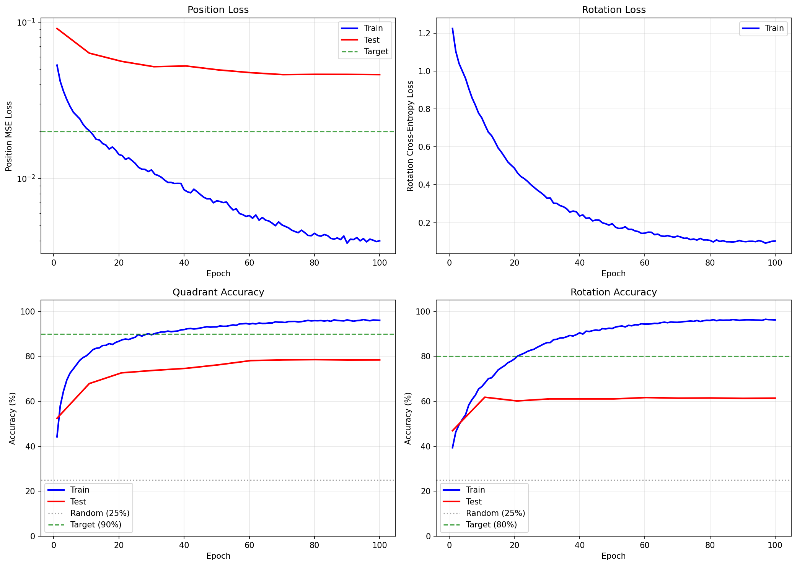
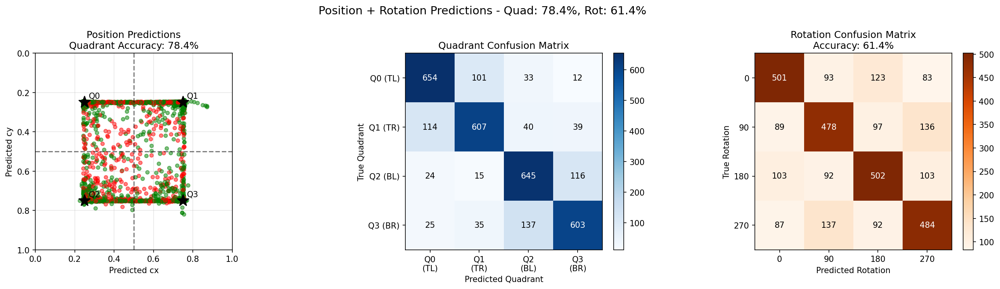

# Experiment 10: Add Rotation Prediction

## Objective

Extend the position prediction model from exp9 to also predict piece rotation (0°, 90°, 180°, 270°). This is a multi-task learning approach where the model must predict BOTH where a piece belongs AND how it's rotated.

**Key Question**: Can we maintain the 93% position accuracy from exp9 while simultaneously learning to predict rotation?

## Background

### Previous Results Summary

| Experiment | Configuration | Test Accuracy | Key Finding |
|------------|---------------|---------------|-------------|
| exp7 (Phase 1) | 256x256, frozen backbone | 67.0% | Spatial correlation works |
| exp8 | 512x512, frozen backbone | 59.0% | Higher resolution hurts |
| exp9 (Phase 2) | 256x256, fine-tuned backbone | **93.0%** | Task-specific features essential |

### Why Add Rotation?

Exp9 achieved 93% quadrant accuracy, exceeding all targets. The natural next step is to increase task complexity by adding rotation prediction:

1. **Real puzzle pieces can be rotated**: In actual puzzles, pieces may be placed in any of 4 orientations
2. **Multi-task learning opportunity**: Position and rotation are related but distinct tasks - can the model learn both?
3. **Stepping stone to full puzzle solving**: A complete solver needs both position AND rotation

**Hypothesis**: The fine-tuned backbone from exp9 should provide rich enough features to support both tasks. The rotation head can learn from piece features alone since rotation is an intrinsic property of the piece appearance.

## Experiment Design

### Key Changes from Exp9

| Aspect | Exp9 | Exp10 |
|--------|------|-------|
| Output | Position (cx, cy) | Position (cx, cy) + Rotation (4 classes) |
| Samples per puzzle | 4 (one per quadrant) | 16 (4 quadrants × 4 rotations) |
| Loss function | MSE only | MSE + Cross-Entropy |
| New parameters | - | Rotation head (~164K params) |
| Total parameters | 2,001,891 | 2,166,311 |

### Architecture

```
DualInputRegressorWithRotation
├── Piece Encoder: MobileNetV3-Small (UNFROZEN, LR=1e-4)
│   └── Input: 128x128 → Output: 576-dim vector
├── Puzzle Encoder: MobileNetV3-Small (UNFROZEN, LR=1e-4)
│   └── Input: 256x256 → Output: 576-dim × 8×8 spatial map
├── Spatial Correlation Module (LR=1e-3)
│   ├── Piece projection with dropout
│   ├── Puzzle projection with dropout
│   ├── Correlation + softmax attention
│   └── Weighted position output → (cx, cy)
├── Refinement Head (LR=1e-3)
│   └── Small MLP with dropout → refined (cx, cy)
└── Rotation Head (NEW, LR=1e-3)
    ├── Linear(576, 256) + ReLU + Dropout
    ├── Linear(256, 64) + ReLU + Dropout
    └── Linear(64, 4) → rotation logits
```

### Multi-Task Loss

```
total_loss = position_weight × MSE(pred_pos, target_pos)
           + rotation_weight × CrossEntropy(pred_rot, target_rot)
```

Both weights set to 1.0 (equal importance).

### Training Configuration

| Parameter | Value |
|-----------|-------|
| Training puzzles | 800 (12,800 samples) |
| Test puzzles | 200 (3,200 samples) |
| Piece size | 128x128 |
| Puzzle size | 256x256 |
| Epochs | 100 |
| Batch size | 64 |
| Backbone LR | 1e-4 |
| Head LR | 1e-3 |
| Weight decay | 1e-4 |
| Dropout | 0.1 |
| Position weight | 1.0 |
| Rotation weight | 1.0 |
| Optimizer | AdamW |
| LR schedule | Cosine annealing |

### Success Criteria

| Target | Value | Meaning |
|--------|-------|---------|
| Maintain position | > 85% | Multi-task doesn't hurt position |
| Position target | > 90% | Match exp9 performance |
| Rotation target | > 80% | Good rotation prediction |
| Rotation stretch | > 90% | Excellent rotation prediction |

## Results

### Configuration

| Parameter | Value |
|-----------|-------|
| Training puzzles | 800 (12,800 samples) |
| Test puzzles | 200 (3,200 samples) |
| Piece size | 128x128 |
| Puzzle size | 256x256 |
| Epochs | 100 |
| Batch size | 64 |
| Backbone LR | 1e-4 |
| Head LR | 1e-3 |
| Weight decay | 1e-4 |
| Dropout | 0.1 |
| Total parameters | 2,166,311 |
| Training time | 11,509 seconds (~3.2 hours) |

### Training Metrics

| Epoch | Train Pos Loss | Train Rot Loss | Train Quad | Train Rot | Test Quad | Test Rot |
|-------|----------------|----------------|------------|-----------|-----------|----------|
| 1     | 0.0530         | 1.2245         | 44.2%      | 39.4%     | 52.4%     | 46.9%    |
| 10    | 0.0210         | 0.7525         | 80.2%      | 66.5%     | 67.9%     | 61.8%    |
| 20    | 0.0142         | 0.4876         | 86.7%      | 78.8%     | 72.7%     | 60.2%    |
| 30    | 0.0113         | 0.3295         | 89.6%      | 86.1%     | 73.8%     | 61.1%    |
| 40    | 0.0085         | 0.2356         | 91.9%      | 90.5%     | 74.7%     | 61.1%    |
| 50    | 0.0072         | 0.1948         | 93.1%      | 92.4%     | 76.2%     | 61.1%    |
| 60    | 0.0058         | 0.1448         | 94.4%      | 94.3%     | 78.1%     | 61.7%    |
| 70    | 0.0050         | 0.1292         | 95.2%      | 95.1%     | 78.4%     | 61.4%    |
| 80    | 0.0045         | 0.1065         | 95.9%      | 96.0%     | 78.5%     | 61.5%    |
| 90    | 0.0039         | 0.1011         | 96.2%      | 96.1%     | 78.4%     | 61.3%    |
| 100   | 0.0040         | 0.1031         | 96.0%      | 96.2%     | 78.4%     | 61.4%    |

### Training Curves



The training curves clearly show the overfitting problem:
- **Top left**: Position loss continues decreasing on train but plateaus on test
- **Top right**: Rotation loss decreases steadily on train
- **Bottom left**: Quadrant accuracy reaches 96% train but only 78% test
- **Bottom right**: Rotation accuracy reaches 96% train but only 61% test - the largest gap

### Final Results

| Metric | Train | Test | Gap |
|--------|-------|------|-----|
| Position MSE | 0.0037 | 0.0462 | 12.5x worse |
| Quadrant Accuracy | 98.3% | 78.4% | -19.9% |
| Rotation Accuracy | 98.0% | 61.4% | -36.6% |
| Mean Distance | 0.0256 | 0.1283 | 5x worse |

### Comparison with Exp9

| Metric | Exp9 (position only) | Exp10 (position + rotation) | Change |
|--------|----------------------|-----------------------------| -------|
| Test Quadrant Acc | 93.0% | 78.4% | **-14.6%** |
| Test Rotation Acc | N/A | 61.4% | (new task) |
| Test MSE | 0.0167 | 0.0462 | 2.8x worse |
| Test Distance | 0.057 | 0.1283 | 2.3x worse |
| vs Random (quad) | 3.72x | 3.14x | -16% |

### Success Criteria

- Maintain position (>85%): **FAIL** (78.4%)
- Position target (>90%): **FAIL** (78.4%)
- Rotation target (>80%): **FAIL** (61.4%)
- Rotation stretch (>90%): **FAIL** (61.4%)

### Test Predictions Visualization



The visualization shows:
- **Left**: Position predictions scatter plot - green (correct quadrant) vs red (wrong quadrant). More spread than exp9.
- **Center**: Quadrant confusion matrix - diagonal shows correct predictions, off-diagonal shows errors across all quadrants.
- **Right**: Rotation confusion matrix - significant confusion between all rotation classes, especially 0° vs 180° and 90° vs 270°.

## Analysis

### Key Findings

1. **Severe overfitting**: The model achieved near-perfect training accuracy (98%+ for both tasks) but much lower test accuracy (78% quadrant, 61% rotation). The train-test gap is massive.

2. **Position accuracy regressed**: Adding rotation prediction hurt position accuracy significantly, dropping from 93% (exp9) to 78.4% - a 14.6 percentage point decrease.

3. **Rotation does not generalize**: Test rotation accuracy plateaued around epoch 10-20 at ~61% and never improved, while training rotation accuracy continued to 98%. The model memorizes rotation patterns for specific puzzles but cannot generalize.

4. **Early plateau**: Test metrics stopped improving around epoch 20-30, while training metrics continued improving through epoch 100, indicating classic overfitting.

### Root Cause Analysis

There are two primary issues: **an architectural flaw** and **data structure causing memorization**.

#### 1. Architectural Flaw: Global Pooling Destroys Rotation Information

The rotation head receives globally-pooled piece features:

```python
piece_feat_map = self.piece_features(piece)  # (B, 576, 4, 4) - has spatial info
piece_feat = self.piece_pool(piece_feat_map).flatten(1)  # (B, 576) - spatial info LOST
rotation_logits = self.rotation_head(piece_feat)  # Can't distinguish orientations!
```

**This is fundamentally broken for rotation prediction.** Consider a piece with "sky at top, grass at bottom":

```
0° (correct):       180° (rotated):
+----------+        +----------+
|  sky     |        |  grass   |
+----------+   vs   +----------+
|  grass   |        |  sky     |
+----------+        +----------+

After global avg pooling: NEARLY IDENTICAL feature vectors
```

Both contain the same textures — the only difference is their spatial arrangement, which pooling discards. The confusion matrix confirms this: **0° vs 180° and 90° vs 270° have the highest confusion** — exactly the "opposite" rotations that pooling makes indistinguishable.

To predict rotation, the model needs to answer: "Where is the sky relative to the grass IN THIS PIECE?" This requires preserving spatial structure, not pooling it away.

#### 2. Data Structure Causing Memorization

1. **16x exposure per puzzle**: Each puzzle appears 16 times per epoch (4 quadrants × 4 rotations) vs 4 times in exp9. This makes it easier for the model to memorize puzzle-specific features.

2. **Rotation is texture-dependent**: Predicting rotation requires recognizing orientation from texture/pattern features. These features may be too puzzle-specific to generalize.

3. **Insufficient regularization**: With 4x more samples per puzzle, the existing dropout (0.1) and weight decay (1e-4) are insufficient to prevent overfitting.

4. **Task interference**: The shared backbone may be learning features that are good for memorizing training puzzles rather than features that generalize.

### Why Multi-Task Learning Failed

Unlike the successful transition from exp7→exp9, this experiment suffered because:

| Factor | Exp9 Success | Exp10 Failure |
|--------|--------------|---------------|
| **Architecture** | Spatial features preserved for position | **Spatial features pooled away for rotation** |
| Data diversity | 4 samples/puzzle | 16 samples/puzzle (less diverse) |
| Task nature | Position = spatial matching | Rotation = texture orientation (easy to memorize) |
| Generalization | Cross-puzzle features | Puzzle-specific texture patterns |
| Regularization | Sufficient | Insufficient for 4x more exposure |

The architectural issue is the most critical: the position task succeeded because spatial information was preserved (puzzle keeps its 8×8 feature map). The rotation task failed because spatial information was discarded (piece is globally pooled before the rotation head).

## Conclusion

**The experiment failed to meet its objectives.** Adding rotation prediction caused:
- Significant regression in position accuracy (93% → 78%)
- Poor rotation generalization (61% test vs 98% train)
- Severe overfitting on both tasks

**The fundamental issue is architectural**: global average pooling on the piece discards the spatial information needed for rotation prediction. The confusion matrix shows the highest errors between 0° vs 180° and 90° vs 270° — exactly the "opposite" rotations that become indistinguishable after pooling. No amount of regularization can fix this; the model simply doesn't have access to the information it needs.

Secondary issues include the naive data approach of including all 4 rotations per quadrant, which leads to 16x exposure per puzzle and encourages memorization.

## Next Steps

### 1. Spatial Rotation Head (Critical - Architectural Fix)

**This is the most important fix.** The rotation head must receive spatial features, not pooled features:

```python
# Current (broken):
piece_feat = self.piece_pool(piece_feat_map).flatten(1)  # (B, 576) - loses spatial info
rotation_logits = self.rotation_head(piece_feat)

# Proposed fix:
piece_feat_map = self.piece_features(piece)  # (B, 576, 4, 4) - keep spatial info
rotation_logits = self.spatial_rotation_head(piece_feat_map)  # Small CNN → 4 classes
```

The spatial rotation head could be:
- A small CNN (Conv2d → Pool → FC → 4 classes)
- Or flatten the 4×4×576 features and use an MLP

This allows the model to learn "sky at top = 0°, sky at bottom = 180°" which is impossible with pooled features.

### 2. Random Rotation Sampling
Instead of including all 4 rotations per puzzle-quadrant pair, randomly sample ONE rotation per piece during training:
- Reduces puzzle exposure from 16x to 4x per epoch (same as exp9)
- Forces the model to learn general rotation features
- Maintains data diversity

### 3. Two-Phase Training
- Phase 1: Train position only (reproduce exp9 results)
- Phase 2: Freeze position components, train rotation head only
- Prevents position regression while learning rotation

### 4. Stronger Regularization
- Increase dropout from 0.1 to 0.2-0.3
- Increase weight decay from 1e-4 to 1e-3
- Add label smoothing for rotation classification

### 5. Data Augmentation
- Add more aggressive augmentation to the rotated pieces
- Use mixup or cutmix to increase effective dataset diversity

## Relationship to Previous Experiments

```
exp1 (baseline sanity)     → Verified training works
        ↓
exp2 (single puzzle reg)   → Verified regression works for memorization
        ↓
exp3-4 (classification)    → Classification needs more capacity
        ↓
exp5-6 (generalization)    → 950 classes: generalization fails completely
        ↓
exp7 (coarse + correlation)→ 67% test accuracy (spatial correlation breakthrough!)
        ↓
exp8 (high resolution)     → 512x512: 59% (resolution not the answer)
        ↓
exp9 (fine-tuning)         → 93% test accuracy (FINE-TUNING SUCCESS!)
        ↓
exp10 (THIS EXPERIMENT)    → 78% quad, 61% rot (OVERFITTING - multi-task failed)
        ↓
(future: exp11...)         → Random rotation sampling or two-phase training
```

## File Structure

```
experiments/exp10_add_rotation/
├── README.md           # This file
├── __init__.py         # Package marker
├── dataset.py          # QuadrantRotationDataset (4 quadrants × 4 rotations)
├── model.py            # DualInputRegressorWithRotation (+ rotation head)
├── train.py            # Multi-task training with position + rotation loss
├── visualize.py        # Visualization with rotation confusion matrix
├── generate_pieces.py  # Piece generation with rotation variants
└── outputs/            # Saved models and visualizations
    ├── model.pt
    ├── model_best.pt
    ├── checkpoint_latest.pt
    ├── test_predictions.png
    ├── training_curves.png
    └── experiment_results.json
```

## Usage

```bash
cd network
source ../venv/bin/activate

# Run with default settings
python -m experiments.exp10_add_rotation.train

# Custom loss weights
python -m experiments.exp10_add_rotation.train --position-weight 1.0 --rotation-weight 0.5

# More regularization
python -m experiments.exp10_add_rotation.train --dropout 0.2 --weight-decay 1e-3

# All options
python -m experiments.exp10_add_rotation.train \
    --epochs 100 \
    --batch-size 64 \
    --backbone-lr 1e-4 \
    --head-lr 1e-3 \
    --dropout 0.1 \
    --weight-decay 1e-4 \
    --position-weight 1.0 \
    --rotation-weight 1.0
```

## Summary

| Aspect | Exp9 | Exp10 | Verdict |
|--------|------|-------|---------|
| Approach | Fine-tune backbone | Add rotation head | More complex |
| Test Quadrant Acc | 93.0% | 78.4% | Regression |
| Test Rotation Acc | N/A | 61.4% | Poor |
| Overfitting | Minimal | Severe | Problem |
| Conclusion | Success | Failure | Needs redesign |

**Bottom line**: The rotation head cannot work with globally-pooled piece features. Global pooling discards the spatial information needed to distinguish rotations — explaining why 0° vs 180° and 90° vs 270° have the highest confusion (they're identical after pooling). Future experiments must use a spatial rotation head that preserves the piece's feature map structure. Secondary improvements include random rotation sampling to reduce the 16x puzzle exposure that encourages memorization.
