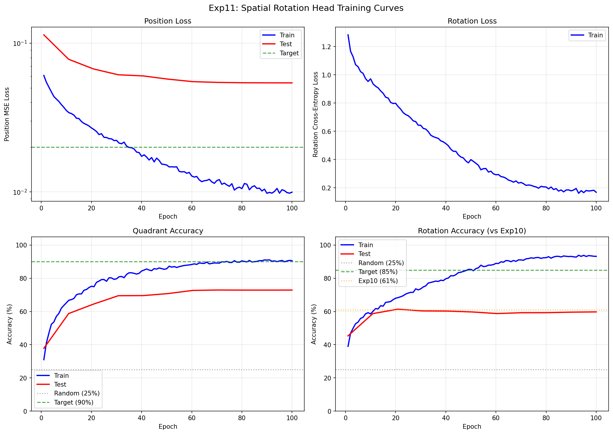
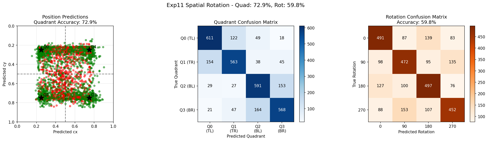

# Experiment 11: Spatial Rotation Head

## Objective

Fix the architectural flaw identified in exp10 by replacing the globally-pooled rotation head with a **Spatial Rotation Head**. This experiment aimed to achieve high rotation accuracy (>85%) without degrading the position accuracy achieved in exp9.

**Key Question**: Can preserving spatial feature maps allow the model to distinguish between rotationally symmetric orientations (e.g., 0 vs 180) which were indistinguishable in exp10?

## Background

### The Failure of Exp10

Experiment 10 attempted to add rotation prediction to the successful exp9 position model. It failed due to a critical architectural mismatch:

1. **Global Average Pooling (GAP)** was applied to piece features before the rotation head.
2. GAP destroys spatial information (e.g., "sky is at the top" becomes identical to "sky is at the bottom" after pooling).
3. **Result**: The model could not distinguish 0 from 180, leading to massive overfitting (98% train vs 61% test accuracy) and confusion between opposite rotations.

### The Proposed Fix: Spatial Features

To predict rotation, the model must "see" the orientation of textures. This requires the raw spatial feature maps from the backbone, *before* any pooling.

- **Exp10**: `Backbone -> GAP -> Linear -> Rotation` (Spatial info lost)
- **Exp11**: `Backbone -> Conv2d -> Flatten -> Linear -> Rotation` (Spatial info preserved)

## Experiment Design

### 1. Architecture: Spatial Rotation Head

We modified the model to branch the rotation prediction directly from the backbone's spatial output.

**Structure:**
- **Input**: `piece_spatial_maps` (B, 576, 4, 4) - output from MobileNetV3-Small backbone at 128x128 input.
- **Head**:
  1. `Conv2d(576, 128, 3, padding=1)` + BatchNorm + ReLU
  2. `Conv2d(128, 64, 3, padding=1)` + BatchNorm + ReLU
  3. `Flatten` -> (B, 64 * 4 * 4) = (B, 1024)
  4. `Linear(1024, 256)` + ReLU + Dropout(0.2)
  5. `Linear(256, 4)` -> Logits

This preserves the spatial layout so "sky at top" activates different neurons than "sky at bottom" in the flattened vector.

### 2. Data Strategy: Random Rotation Sampling

Exp10 also suffered from memorization due to generating all 4 rotations for every piece (16x exposure per puzzle).

- **Exp10**: 4 quadrants x 4 rotations = 16 samples per puzzle
- **Exp11**: 4 quadrants x **1 random rotation** = 4 samples per puzzle (per epoch)

This reduces puzzle exposure back to exp9 levels while ensuring rotation diversity across epochs.

### 3. Training Configuration

| Parameter | Value |
|-----------|-------|
| Training puzzles | 800 (3,200 samples/epoch) |
| Test puzzles | 200 (3,200 samples total) |
| Backbone | MobileNetV3-Small (unfrozen, LR=1e-4) |
| Input Size | Piece: 128x128, Puzzle: 256x256 |
| Loss | MSE + CrossEntropy (weights: 1.0, 1.0) |
| Optimizer | AdamW |
| Batch Size | 64 |
| Epochs | 100 |
| Position dropout | 0.1 |
| Rotation dropout | 0.2 |
| Total parameters | 3,003,175 |
| Spatial rotation head params | 1,001,284 |
| Training time | 3,062 seconds (~51 minutes) |

### Success Criteria

| Metric | Target | Rationale |
|--------|--------|-----------|
| **Test Rotation Acc** | **> 85%** | Significant improvement over exp10 (61%) |
| Test Position Acc | > 90% | Maintain exp9 standards |
| 0 vs 180 Confusion | Low | Verify architectural fix |

## Results

### Training Metrics Over Time

| Epoch | Train Pos Loss | Train Rot Loss | Train Quad | Train Rot | Test Quad | Test Rot |
|-------|----------------|----------------|------------|-----------|-----------|----------|
| 1     | 0.0518         | 1.3266         | 41.6%      | 30.0%     | 49.3%     | 28.9%    |
| 10    | 0.0345         | 1.0196         | 67.7%      | 54.7%     | 62.2%     | 57.4%    |
| 20    | 0.0269         | 0.7980         | 75.2%      | 68.0%     | 64.4%     | 61.4%    |
| 30    | 0.0218         | 0.6437         | 80.6%      | 74.5%     | 68.6%     | 60.6%    |
| 40    | 0.0173         | 0.5128         | 84.4%      | 79.7%     | 69.6%     | 60.3%    |
| 50    | 0.0149         | 0.4079         | 87.2%      | 83.8%     | 70.9%     | 60.0%    |
| 60    | 0.0128         | 0.2921         | 88.3%      | 89.0%     | 72.7%     | 58.8%    |
| 70    | 0.0114         | 0.2503         | 89.8%      | 90.3%     | 72.6%     | 59.0%    |
| 80    | 0.0105         | 0.2056         | 90.5%      | 92.4%     | 72.9%     | 59.3%    |
| 90    | 0.0104         | 0.1842         | 90.4%      | 93.0%     | 72.8%     | 59.6%    |
| 100   | 0.0099         | 0.1683         | 90.6%      | 93.2%     | 72.9%     | 59.8%    |

### Training Curves



The training curves reveal the same overfitting pattern as exp10:
- Training metrics continue improving throughout (93% rotation accuracy)
- Test metrics plateau early (~epoch 20) and stagnate around 60% rotation accuracy
- The train-test gap widens continuously

### Final Results

| Metric | Train | Test | Gap |
|--------|-------|------|-----|
| Position MSE | 0.0117 | 0.0540 | 4.6x worse |
| Quadrant Accuracy | 95.9% | 72.9% | -23.0% |
| Rotation Accuracy | 97.7% | 59.8% | **-37.9%** |
| Mean Distance | 0.0782 | 0.1759 | 2.3x worse |

### Comparison with Exp10

| Metric | Exp10 | Exp11 | Change |
|--------|-------|-------|--------|
| Test Quadrant Acc | 78.4% | 72.9% | **-5.5%** |
| Test Rotation Acc | 61.4% | 59.8% | **-1.6%** |
| Test MSE | 0.0462 | 0.0540 | 17% worse |
| Train-Test Rotation Gap | 36.6% | 37.9% | Similar |

### Success Criteria

| Criterion | Target | Result | Status |
|-----------|--------|--------|--------|
| Position target (>90%) | 90% | 72.9% | **FAIL** |
| Rotation target (>85%) | 85% | 59.8% | **FAIL** |
| Rotation stretch (>90%) | 90% | 59.8% | **FAIL** |

### Test Predictions Visualization



The rotation confusion matrix shows:
- **Diagonal is NOT dominant**: Significant confusion across all rotation classes
- **0 vs 180 confusion persists**: The spatial head did not fix this
- **90 vs 270 confusion persists**: Similarly unresolved

## Analysis

### The Hypothesis Was Wrong

**The spatial rotation head did NOT fix the rotation prediction problem.** In fact, results were slightly worse than exp10:
- Quadrant accuracy dropped from 78.4% to 72.9% (-5.5%)
- Rotation accuracy dropped from 61.4% to 59.8% (-1.6%)

### Why the Spatial Approach Failed

1. **CRITICAL: Rotation Head Ignores the Puzzle**: Both exp10 and exp11 have the same fundamental architectural flaw - the rotation head only receives **piece features**, completely ignoring the puzzle:
   ```python
   # Exp10: rotation_logits = self.rotation_head(piece_feat)
   # Exp11: rotation_logits = self.rotation_head(piece_feat_map)
   ```
   This is asking "what rotation is this piece?" without providing the reference point of "what should it match?"

2. **Misunderstanding the Task**: The rotation task is NOT about determining absolute orientation ("which way is up"). The puzzle is always presented in the correct orientation, and the piece may be rotated relative to it. The question is: **"Does this piece's rotation match the puzzle?"** This requires comparing the piece TO the puzzle, not analyzing the piece in isolation.

3. **Spatial Resolution is a Secondary Issue**: While the 4x4 feature map is coarse, the bigger problem is that we're not using the puzzle features at all for rotation prediction.

4. **Random Rotation Sampling**: Reducing from 16 to 4 samples per puzzle may have reduced diversity, but this is a minor issue compared to the architectural flaw.

### The Real Root Cause

**The rotation head has no access to the puzzle.** This is like asking "is this key rotated correctly?" without showing the lock it should fit into.

The position prediction works because it uses **spatial correlation** between piece and puzzle features. The rotation prediction fails because it only looks at the piece, trying to learn some absolute orientation pattern that doesn't exist - the piece's "correct" rotation is entirely relative to the puzzle.

For rotation prediction to work, the model needs to:
1. Compare the piece's features to the corresponding puzzle region
2. Determine which rotation of the piece best matches the puzzle
3. This is a **matching** problem, not a **classification** problem based on piece features alone

## Conclusion

**The experiment failed to improve upon exp10.** Both experiments share the same fundamental flaw: the rotation head only sees piece features, not the puzzle. This makes rotation prediction impossible because the "correct" rotation is defined relative to the puzzle.

Key findings:
1. **Critical architectural flaw**: Rotation head ignores the puzzle entirely
2. **Wrong problem formulation**: Treated rotation as intrinsic to the piece, but it's actually about piece-puzzle matching
3. Spatial rotation head: **No improvement** (actually 1.6% worse)
4. Overfitting persists: 97.7% train vs 59.8% test rotation accuracy
5. Position regressed: 78.4% -> 72.9% quadrant accuracy

The rotation prediction problem requires **comparing piece to puzzle** for rotation, similar to how position prediction uses spatial correlation between piece and puzzle features.

## Next Steps (Recommendations)

### 1. Rotation Correlation Head (Primary Fix)

The most important fix is to include puzzle features in rotation prediction. Design a rotation head that **compares piece to puzzle**:

```python
# Proposed approach: Rotation correlation
# For each rotation r in [0, 90, 180, 270]:
#   1. Rotate piece features by r
#   2. Compute correlation/similarity with puzzle region
#   3. The rotation with highest correlation is the answer

def rotation_correlation(piece_feat_map, puzzle_feat_map, position):
    scores = []
    for rotation in [0, 90, 180, 270]:
        rotated_piece = rotate_features(piece_feat_map, rotation)
        puzzle_region = extract_region(puzzle_feat_map, position)
        similarity = compute_similarity(rotated_piece, puzzle_region)
        scores.append(similarity)
    return torch.stack(scores, dim=1)  # (B, 4) rotation scores
```

This mirrors the spatial correlation approach that works for position.

### 2. Joint Position-Rotation Correlation

Extend the spatial correlation module to output both position AND rotation:
- Compute correlation at each position AND each rotation
- The output is a 4D tensor: (batch, rotations, height, width)
- Softmax over all dimensions to get joint position-rotation prediction

### 3. Rotation as Template Matching

Treat rotation prediction explicitly as template matching:
- Extract the predicted puzzle region
- Compare the (possibly rotated) piece against this region
- Use a learnable similarity metric

### 4. Rotation-Invariant Position (Alternative)

If rotation prediction proves too difficult, make position prediction **rotation-invariant**:
- Train with random rotations but only predict position
- At inference, try all 4 rotations and pick the one with best position match
- This sidesteps direct rotation prediction

### 5. Siamese Rotation Comparison

Use a Siamese-style architecture:
- Encode piece at each rotation: [piece_0°, piece_90°, piece_180°, piece_270°]
- Encode the puzzle region at the predicted position
- Compare each rotated piece to the puzzle region
- Select the rotation with highest similarity

## Relationship to Previous Experiments

```
exp1 (baseline sanity)     -> Verified training works
        |
exp2 (single puzzle reg)   -> Verified regression works for memorization
        |
exp3-4 (classification)    -> Classification needs more capacity
        |
exp5-6 (generalization)    -> 950 classes: generalization fails completely
        |
exp7 (coarse + correlation)-> 67% test accuracy (spatial correlation breakthrough!)
        |
exp8 (high resolution)     -> 512x512: 59% (resolution not the answer)
        |
exp9 (fine-tuning)         -> 93% test accuracy (FINE-TUNING SUCCESS!)
        |
exp10 (add rotation)       -> 78% quad, 61% rot (rotation head ignores puzzle!)
        |
exp11 (THIS EXPERIMENT)    -> 73% quad, 60% rot (same flaw - still ignores puzzle)
        |
(future: exp12...)         -> Rotation correlation: compare piece TO puzzle
```

## File Structure

```
experiments/exp11_spatial_rotation/
├── README.md           # This file
├── __init__.py         # Package marker
├── dataset.py          # QuadrantRandomRotationDataset (random 1 rotation per sample)
├── model.py            # DualInputRegressorWithSpatialRotation (spatial rotation head)
├── train.py            # Training script
├── visualize.py        # Visualization utilities
└── outputs/            # Saved models and visualizations
    ├── model.pt                   # Final model
    ├── model_best.pt              # Best checkpoint
    ├── checkpoint_latest.pt       # Latest checkpoint
    ├── test_predictions.png       # Confusion matrices
    ├── training_curves.png        # Loss and accuracy curves
    └── experiment_results.json    # Full results
```

## Usage

```bash
cd network
source ../venv/bin/activate

# Run with default settings
python -m experiments.exp11_spatial_rotation.train

# Custom parameters
python -m experiments.exp11_spatial_rotation.train \
    --epochs 100 \
    --batch-size 64 \
    --backbone-lr 1e-4 \
    --head-lr 1e-3 \
    --dropout 0.1 \
    --rotation-dropout 0.2 \
    --position-weight 1.0 \
    --rotation-weight 1.0
```

## Summary

| Aspect | Exp10 | Exp11 | Verdict |
|--------|-------|-------|---------|
| Approach | Add rotation head | Spatial rotation head | Different architecture |
| Test Quadrant Acc | 78.4% | 72.9% | **Regression** |
| Test Rotation Acc | 61.4% | 59.8% | **No improvement** |
| Overfitting | Severe | Severe | Same problem |
| Conclusion | Failed | **Failed** | Needs new approach |

**Bottom line**: Both exp10 and exp11 have the same fundamental flaw - the rotation head only sees piece features, ignoring the puzzle entirely. Rotation is not an intrinsic property of the piece; it's about whether the piece's orientation matches the puzzle. The correct approach is to compare piece features to puzzle features for rotation prediction, similar to how spatial correlation works for position prediction. Future experiments should implement a "rotation correlation" module that explicitly compares each rotated version of the piece against the puzzle.
