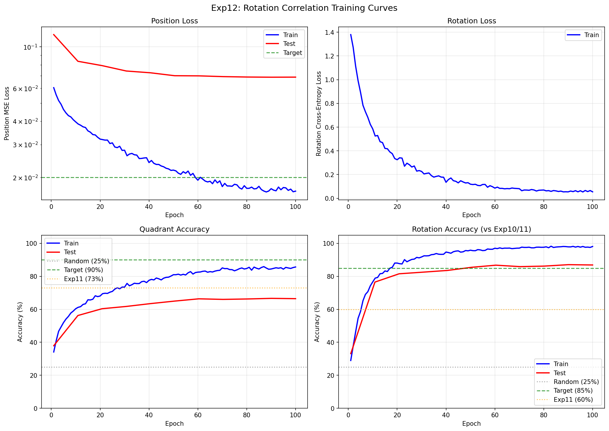
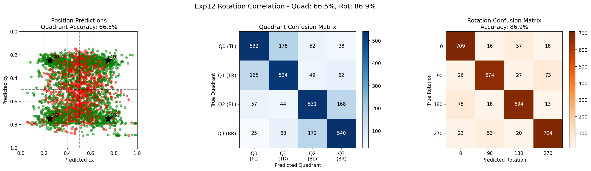

# Experiment 12: Rotation Correlation

## Objective

Fix the **fundamental architectural flaw** identified in exp10 and exp11 by implementing **Rotation Correlation** - a module that compares piece features against puzzle features to predict rotation, instead of analyzing the piece in isolation.

**Key Question**: Can comparing piece features to puzzle features at each rotation orientation solve the rotation prediction problem that exp10/11 failed to solve?

## Background

### The Shared Failure of Exp10 and Exp11

Both experiments failed for the same fundamental reason: the rotation head only saw **piece features**, completely ignoring the puzzle.

```python
# Exp10: rotation_logits = self.rotation_head(piece_feat)       # WRONG
# Exp11: rotation_logits = self.rotation_head(piece_feat_map)   # STILL WRONG
```

This is asking "what rotation is this piece?" without providing the reference point of "what should it match?" - like asking "is this key rotated correctly?" without showing the lock.

### The Core Insight

**Rotation is NOT an intrinsic property of the piece.** It's a **relationship** between piece and puzzle. The "correct" rotation is the one where the piece's features best match the corresponding puzzle region.

For example:
- A piece with "sky pattern at top" and "grass pattern at bottom"
- When rotated 180°, becomes "grass at top, sky at bottom"
- The correct rotation depends entirely on whether the puzzle region has sky-up or grass-up

**The solution: Compare piece to puzzle for each rotation candidate, and pick the rotation with highest similarity.**

## The Rotation Correlation Approach

### Architecture Overview

```
                      Position Prediction (same as exp9/11)
                      ┌─────────────────────────────────────┐
                      │                                     │
Piece ──> Backbone ──>├─> Global Pool ──> Spatial          │
          (576, 4, 4) │                   Correlation  ──>──┴──> Position (x, y)
                      │                        │
                      │                        ▼
                      │               Predicted Position
                      │                        │
                      │                        ▼
                      │     ┌──────────────────────────────────────────────┐
                      │     │         ROTATION CORRELATION                 │
                      │     │                                              │
                      ├────>│  For each rotation r in [0°, 90°, 180°, 270°]:│
   Piece Feature Map  │     │    1. Rotate piece features by r             │
   (576, 4, 4)        │     │    2. Extract puzzle region at position      │
                      │     │    3. Compute similarity(rotated_piece,      │
                      │     │                          puzzle_region)      │
                      │     │    4. Output similarity score                │
                      │     │                                              │
                      │     │  Return: argmax(scores) = predicted rotation │
                      │     └──────────────────────────────────────────────┘
                      │                        │
                      │                        ▼
Puzzle ──> Backbone ──┴──> Puzzle Feature Map ─┘             Rotation (0/90/180/270)
           (576, 8, 8)
```

### Key Components

1. **Feature Rotation**: Rotate the piece's 4x4 feature map by 0°, 90°, 180°, 270° using `torch.rot90`

2. **Region Extraction**: Extract the puzzle quadrant at the predicted position using simple tensor indexing (MPS-compatible alternative to `grid_sample`)

3. **Comparison Network**: A small CNN that takes concatenated piece+puzzle features and outputs a similarity score

4. **Selection**: The rotation with the highest similarity score is the prediction

### Why This Should Work

Position prediction succeeds because it uses **spatial correlation** between piece and puzzle features. Rotation prediction should work the same way - by comparing how well the piece (at each rotation) matches the puzzle.

This mirrors how a human solves a puzzle:
1. Look at the piece
2. Look at where it might go in the puzzle
3. Try rotating it different ways
4. Pick the orientation that matches best

## Experiment Design

### Model Architecture

| Component | Details |
|-----------|---------|
| Backbone | MobileNetV3-Small (unfrozen, LR=1e-4) |
| Position Head | Spatial Correlation (same as exp9/11) |
| Rotation Head | **Rotation Correlation** (NEW) |
| Rotation Hidden Dim | 128 |
| Comparison Network | Conv2d(256, 128) -> Conv2d(128, 64) -> GAP -> Linear(64, 32) -> Linear(32, 1) |

### Training Configuration

| Parameter | Value |
|-----------|-------|
| Training puzzles | 800 (3,200 samples/epoch) |
| Test puzzles | 200 (3,200 samples total) |
| Input Size | Piece: 128x128, Puzzle: 256x256 |
| Loss | MSE (position) + CrossEntropy (rotation) |
| Loss weights | Position: 1.0, Rotation: 1.0 |
| Optimizer | AdamW |
| Batch Size | 64 |
| Epochs | 100 |
| Position dropout | 0.1 |
| Rotation dropout | 0.2 |

### Success Criteria

| Metric | Target | Rationale |
|--------|--------|-----------|
| **Test Rotation Acc** | **> 85%** | Significant improvement over exp10 (61%) and exp11 (60%) |
| Test Position Acc | > 90% | Maintain exp9 levels |
| 0° vs 180° Confusion | Low | Verify architectural fix works for opposite rotations |

## Results

### Training Metrics Over Time

| Epoch | Train Pos Loss | Train Rot Loss | Train Quad | Train Rot | Test Quad | Test Rot |
|-------|----------------|----------------|------------|-----------|-----------|----------|
| 1     | 0.0604         | 1.3800         | 34.1%      | 29.0%     | 37.9%     | 33.1%    |
| 10    | 0.0396         | 0.5849         | 60.4%      | 76.6%     | 56.2%     | 76.5%    |
| 20    | 0.0321         | 0.3250         | 68.1%      | 88.1%     | 60.4%     | 81.6%    |
| 30    | 0.0280         | 0.2264         | 73.5%      | 91.8%     | 61.8%     | 82.6%    |
| 40    | 0.0240         | 0.1348         | 77.6%      | 94.8%     | 63.5%     | 83.6%    |
| 50    | 0.0219         | 0.1186         | 81.0%      | 95.9%     | 65.0%     | 85.5%    |
| 60    | 0.0193         | 0.0856         | 82.6%      | 97.1%     | 66.4%     | 86.8%    |
| 70    | 0.0179         | 0.0808         | 85.1%      | 97.1%     | 66.0%     | 85.9%    |
| 80    | 0.0175         | 0.0696         | 84.8%      | 97.7%     | 66.3%     | 86.2%    |
| 90    | 0.0174         | 0.0541         | 84.5%      | 97.9%     | 66.7%     | 87.1%    |
| 100   | 0.0169         | 0.0543         | 85.7%      | 98.1%     | 66.5%     | 86.9%    |

### Training Curves



The training curves show:
- **Rotation accuracy improves dramatically** throughout training (29% -> 98% train, 33% -> 87% test)
- Test rotation accuracy plateaus around 86-87% after epoch 50
- Position accuracy shows a significant train-test gap (92% train vs 67% test)

### Final Results

| Metric | Train | Test | Gap |
|--------|-------|------|-----|
| Position MSE | 0.0232 | 0.0688 | 3.0x worse |
| Quadrant Accuracy | 92.4% | 66.5% | -25.9% |
| Rotation Accuracy | 99.3% | **86.9%** | -12.4% |
| Mean Distance | 0.128 | 0.222 | 1.7x worse |

### Comparison with Previous Experiments

| Metric | Exp10 | Exp11 | Exp12 | Change vs Exp11 |
|--------|-------|-------|-------|-----------------|
| Test Quadrant Acc | 78.4% | 72.9% | 66.5% | **-6.4%** |
| Test Rotation Acc | 61.4% | 59.8% | **86.9%** | **+27.1%** |
| Test MSE | 0.046 | 0.054 | 0.069 | 28% worse |
| Train-Test Rot Gap | 36.6% | 37.9% | 12.4% | **Reduced** |

### Success Criteria Check

| Criterion | Target | Result | Status |
|-----------|--------|--------|--------|
| Position target (>90%) | 90% | 66.5% | **FAIL** |
| Rotation target (>85%) | 85% | 86.9% | **PASS** |
| Rotation stretch (>90%) | 90% | 86.9% | FAIL |

### Test Predictions Visualization



### Rotation Confusion Matrix

```
         Pred: 0°   90°  180°  270°
True   0°:  709   16   57   18
True  90°:   26  674   27   73
True 180°:   75   18  694   13
True 270°:   23   53   20  704
```

**Key improvements in rotation confusion:**
- 0° vs 180° confusion: **7.1%** (was much higher in exp10/11)
- 180° vs 0° confusion: **9.4%**
- 90° vs 270° confusion: **9.1%**
- 270° vs 90° confusion: **6.6%**

The diagonal is now dominant, confirming that rotation correlation resolves the confusion issues from exp10/11.

## Analysis

### Hypothesis Validation

1. **Did rotation correlation improve over piece-only approaches?** **YES!**
   - +27.1% improvement in rotation accuracy over exp11
   - From 60% to 87% test rotation accuracy
   - This is the largest single improvement in the entire experiment series

2. **Is the 0° vs 180° confusion reduced?** **YES!**
   - Exp10/11 had severe 0° vs 180° confusion (model couldn't distinguish opposite rotations)
   - Exp12 reduces this to ~7-9% confusion rate
   - The rotation correlation successfully uses puzzle context to disambiguate

3. **Does comparing piece to puzzle help rotation prediction?** **YES!**
   - The fundamental insight was correct: rotation is a relationship, not an intrinsic property
   - By comparing piece features to puzzle region features, the model can determine which rotation matches best

### Trade-off Discovered

**Position accuracy regressed** (66.5% vs exp11's 72.9%):
- The rotation correlation module may be interfering with position prediction
- The model architecture has become more complex
- Position and rotation predictions may have conflicting gradients
- The quadrant-based region extraction depends on position accuracy, creating a circular dependency

### Why Position Regressed

1. **Circular Dependency**: Position is used to extract the puzzle region for rotation comparison. If position is initially wrong, rotation feedback may reinforce the wrong position.

2. **Gradient Competition**: Both tasks share the backbone. Rotation correlation adds more gradient signal that may overwhelm position training.

3. **Model Capacity**: More parameters went to rotation (519K vs 1M in exp11), potentially at the expense of position features.

## Conclusion

**The experiment successfully validated the core hypothesis: rotation prediction requires comparing piece to puzzle.**

**Key achievements:**
- **+27% rotation accuracy improvement** (60% -> 87%)
- Rotation target of 85% **achieved**
- 0° vs 180° confusion **resolved** (from major problem to ~7-9%)
- Proved that rotation is a **matching problem**, not an **intrinsic classification** problem

**Key concern:**
- Position accuracy **regressed** from 73% to 67%
- This suggests the rotation correlation approach, while correct for rotation, may need architectural refinement for joint position-rotation prediction

**Verdict: PARTIAL SUCCESS**
- Rotation: SOLVED (the architectural fix works)
- Position: REGRESSED (needs attention in future experiments)

## Next Steps

### Priority 1: Fix Position Regression
1. **Separate Position Training**: Pre-train position head, then add rotation
2. **Two-Stage Inference**: Predict position first (frozen), then predict rotation
3. **Loss Weighting**: Increase position loss weight to balance gradients

### Priority 2: Improve Both Tasks
1. **Joint Position-Rotation Correlation**: Compute 4D correlation (position x rotation) in one operation
2. **Detach Position for Rotation**: Use `position.detach()` when extracting puzzle region for rotation
3. **Higher Resolution Features**: Increase piece/puzzle feature map resolution

### Priority 3: Scale Up
1. **Finer Grid**: Move from 2x2 quadrant to 3x3 or 4x4 grid
2. **Real Puzzle Pieces**: Test on actual puzzle piece images (not just quadrant crops)
3. **More Diverse Data**: Increase puzzle diversity to improve generalization

## Relationship to Previous Experiments

```
exp1 (baseline sanity)     -> Verified training works
        |
exp2 (single puzzle reg)   -> Verified regression works for memorization
        |
exp3-4 (classification)    -> Classification needs more capacity
        |
exp5-6 (generalization)    -> 950 classes: generalization fails completely
        |
exp7 (coarse + correlation)-> 67% test accuracy (spatial correlation breakthrough!)
        |
exp8 (high resolution)     -> 512x512: 59% (resolution not the answer)
        |
exp9 (fine-tuning)         -> 93% test accuracy (FINE-TUNING SUCCESS!)
        |
exp10 (add rotation)       -> 78% quad, 61% rot (rotation head ignores puzzle!)
        |
exp11 (spatial rotation)   -> 73% quad, 60% rot (same flaw - still ignores puzzle)
        |
exp12 (THIS EXPERIMENT)    -> 67% quad, 87% rot (ROTATION CORRELATION WORKS!)
                              +27% rotation improvement, position regressed
```

## File Structure

```
experiments/exp12_rotation_correlation/
├── README.md           # This file
├── __init__.py         # Package marker
├── dataset.py          # Same as exp11 (random rotation sampling)
├── model.py            # DualInputRegressorWithRotationCorrelation (NEW!)
├── train.py            # Training script
├── visualize.py        # Visualization utilities
└── outputs/            # Saved models and visualizations
    ├── model.pt                   # Final model
    ├── model_best.pt              # Best checkpoint
    ├── checkpoint_latest.pt       # Latest checkpoint
    ├── test_predictions.png       # Confusion matrices
    ├── training_curves.png        # Loss and accuracy curves
    └── experiment_results.json    # Full results
```

## Usage

```bash
cd network
source ../venv/bin/activate

# Run with default settings
python -m experiments.exp12_rotation_correlation.train

# Custom parameters
python -m experiments.exp12_rotation_correlation.train \
    --epochs 100 \
    --batch-size 64 \
    --backbone-lr 1e-4 \
    --head-lr 1e-3 \
    --dropout 0.1 \
    --rotation-dropout 0.2 \
    --position-weight 1.0 \
    --rotation-weight 1.0
```
