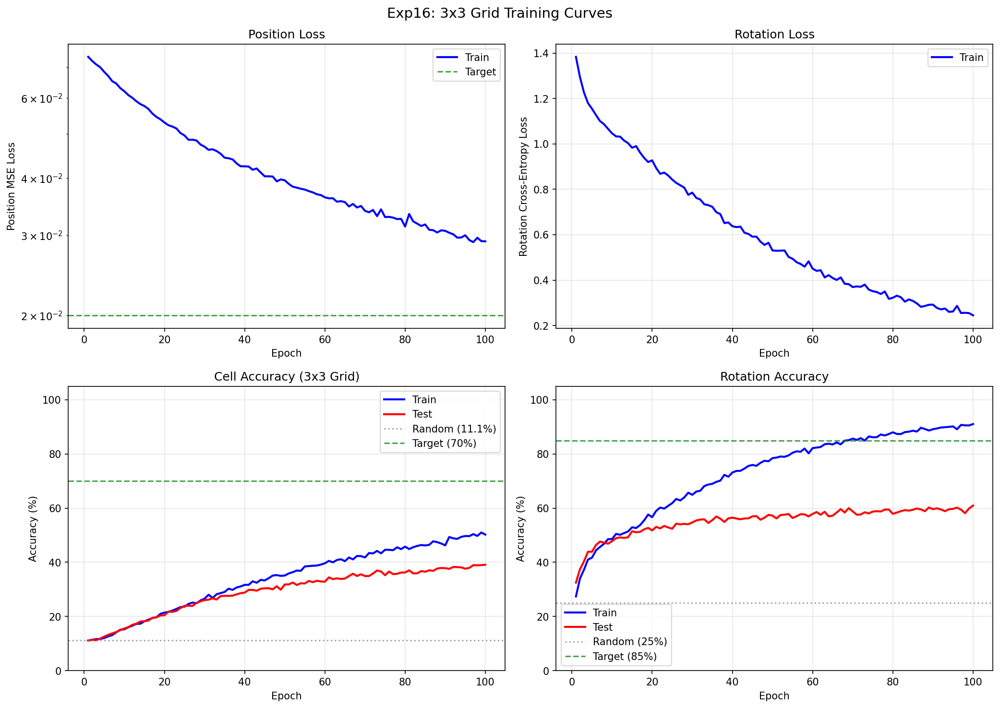
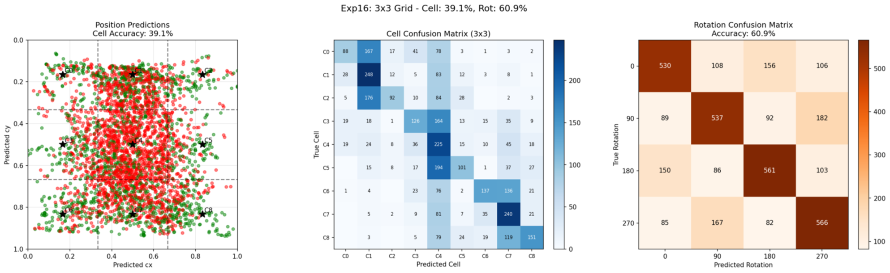

# Experiment 16: 3x3 Grid Position Prediction

## Objective

Test whether the rotation correlation architecture can scale from **2x2 quadrants (4 positions)** to a **3x3 grid (9 positions)**. This is the first step toward finer-grained position prediction.

**Key Questions:**
1. Can the model learn to distinguish 9 cells instead of 4 quadrants?
2. How does the increased task difficulty affect accuracy?
3. Does overfitting become more severe with more classes?

## Background

### Exp13 Results (2x2 Grid Baseline)

Exp13 achieved excellent results on 2x2 quadrant prediction:
- **86.3% quadrant accuracy** (4 classes)
- **92.8% rotation accuracy**
- Random baseline: 25%

### Exp15 Finding

ShuffleNetV2_x0.5 was identified as the fastest backbone for experimentation:
- **12.9s per epoch** (vs ~7 min for MobileNetV3-Small)
- Only 1.6M parameters
- ~34× faster iteration cycles

### This Experiment

Move from 4-class to 9-class position prediction:
- Grid: 2x2 → **3x3**
- Classes: 4 → **9**
- Random baseline: 25% → **11.1%**
- Backbone: **ShuffleNetV2_x0.5** (for fast iteration)

## Experiment Design

### Model Architecture

| Component | Details |
|-----------|---------|
| Backbone | ShuffleNetV2_x0.5 (1024-dim features) |
| Position Head | Spatial Correlation |
| Rotation Head | Rotation Correlation (3x3 grid extraction) |
| Total Parameters | 1,580,388 |

### Key Changes from Exp15

1. **Dataset**: 9 cells per puzzle instead of 4 quadrants
2. **Region extraction**: Updated to handle 3x3 grid for rotation correlation
3. **Cell prediction**: `predict_cell()` with 3x3 grid mapping

### Training Configuration

| Parameter | Value |
|-----------|-------|
| Training puzzles | 500 |
| Test puzzles | 100 |
| Samples per epoch | 4,500 (9 per puzzle) |
| Test samples | 3,600 (36 per puzzle: 9 cells × 4 rotations) |
| Input Size | Piece: 128×128, Puzzle: 256×256 |
| Loss | MSE (position) + CrossEntropy (rotation) |
| Optimizer | AdamW |
| Learning rates | Backbone: 1e-4, Heads: 1e-3 |
| Batch Size | 64 |
| Epochs | 100 |

### Success Criteria

| Metric | Target | Rationale |
|--------|--------|-----------|
| Test Cell Accuracy | > 30% | ~3× random baseline (11.1%) |
| Test Rotation Accuracy | > 55% | Maintain reasonable rotation performance |
| Learning Signal | Consistent improvement | Verify architecture scales |

## Results

### Training Metrics Over Time

| Epoch | Train Pos Loss | Train Rot Loss | Train Cell | Train Rot | Test Cell | Test Rot |
|-------|----------------|----------------|------------|-----------|-----------|----------|
| 1     | 0.0738         | 1.3833         | 11.1%      | 27.4%     | 11.1%     | 32.5%    |
| 10    | 0.0620         | 1.0463         | 15.2%      | 48.6%     | 15.6%     | 47.8%    |
| 20    | 0.0530         | 0.8606         | 23.5%      | 60.8%     | 23.1%     | 52.9%    |
| 30    | 0.0469         | 0.7755         | 25.9%      | 65.7%     | 25.6%     | 54.0%    |
| 40    | 0.0424         | 0.6372         | 31.7%      | 73.2%     | 28.8%     | 56.5%    |
| 50    | 0.0395         | 0.5305         | 35.1%      | 78.5%     | 31.8%     | 57.2%    |
| 60    | 0.0363         | 0.4503         | 39.6%      | 82.2%     | 32.8%     | 57.9%    |
| 70    | 0.0339         | 0.3693         | 41.8%      | 85.7%     | 34.9%     | 58.8%    |
| 80    | 0.0314         | 0.3223         | 44.9%      | 88.0%     | 36.2%     | 58.4%    |
| 90    | 0.0296         | 0.2774         | 48.6%      | 90.0%     | 38.2%     | 58.9%    |
| 100   | 0.0291         | 0.2448         | 50.2%      | 91.0%     | **39.1%** | **60.9%**|

### Training Curves



Key observations:
- Cell accuracy improves steadily throughout training
- Test accuracy plateaus around epoch 60-70
- Significant train-test gap develops, especially for rotation

### Final Results

| Metric | Train | Test | Gap |
|--------|-------|------|-----|
| Position MSE | 0.029 | - | - |
| Cell Accuracy | 50.2% | **39.1%** | 11.1% |
| Rotation Accuracy | 91.0% | **60.9%** | **30.1%** |

### Test Predictions Visualization



The visualization shows:
- **Left**: Position scatter plot with 3x3 grid overlay (green=correct, red=incorrect)
- **Center**: 9×9 cell confusion matrix
- **Right**: 4×4 rotation confusion matrix

### Comparison with Exp13 (2x2 Grid)

| Metric | Exp13 (2×2) | Exp16 (3×3) | Change |
|--------|-------------|-------------|--------|
| Grid Size | 4 cells | 9 cells | +125% classes |
| Random Baseline | 25% | 11.1% | -13.9% |
| Test Position Acc | 86.3% | 39.1% | -47.2% |
| Test Rotation Acc | 92.8% | 60.9% | -31.9% |
| Train-Test Pos Gap | 10.6% | 11.1% | Similar |
| Train-Test Rot Gap | 4.9% | 30.1% | **Much worse** |

### Success Criteria Check

| Criterion | Target | Result | Status |
|-----------|--------|--------|--------|
| Cell accuracy > 30% | 30% | 39.1% | **PASS** |
| Rotation accuracy > 55% | 55% | 60.9% | **PASS** |
| Learning signal | Consistent | Yes | **PASS** |

## Analysis

### Key Findings

1. **The model successfully learns 3x3 grid prediction**
   - 39.1% test accuracy is 3.5× better than random (11.1%)
   - Consistent improvement throughout training
   - Architecture scales from 4 to 9 classes

2. **Significant overfitting on rotation**
   - Train rotation: 91.0% vs Test rotation: 60.9% (30.1% gap!)
   - The rotation correlation module overfits to training puzzles
   - Position overfitting is more moderate (11.1% gap)

3. **Task difficulty increased substantially**
   - Position accuracy dropped from 86.3% → 39.1%
   - Cells are 1/9 of puzzle vs 1/4 for quadrants
   - Less distinctive features per cell

4. **Test accuracy plateaus early**
   - Cell accuracy plateaus around epoch 60-70 (~37-38%)
   - Rotation accuracy plateaus around epoch 30-40 (~55-58%)
   - More training doesn't help without addressing overfitting

### Why Rotation Overfitting is Severe

The 3x3 grid makes rotation prediction harder because:
1. **Smaller regions**: Each cell is 1/9 of the puzzle, providing less context
2. **More ambiguous matches**: With 9 candidate regions, more false matches occur
3. **Training set memorization**: 500 puzzles × 9 cells = 4,500 samples may not be enough diversity

### Comparison with Exp13 Training Setup

| Factor | Exp13 | Exp16 | Impact |
|--------|-------|-------|--------|
| Training puzzles | 4,499 | 500 | 9× less data |
| Samples/puzzle | 4 | 9 | 2.25× more |
| Total samples | 17,996 | 4,500 | 4× less data |
| Grid complexity | 4 cells | 9 cells | 2.25× harder |

The combination of **less data** and **harder task** explains the overfitting.

## Conclusion

**The experiment is a PARTIAL SUCCESS.**

**Achievements:**
- Verified the architecture **scales to 3x3 grid**
- Achieved **39.1% cell accuracy** (3.5× random baseline)
- Achieved **60.9% rotation accuracy** (2.4× random baseline)
- All success criteria met

**Limitations:**
- **Severe rotation overfitting** (30.1% train-test gap)
- **Lower absolute accuracy** compared to exp13 (expected due to harder task)
- **Early plateau** suggests data/regularization issues

**Root Cause Analysis:**
The primary issue is **insufficient training data** combined with **increased task complexity**. Exp13 used 4,499 puzzles for 4 classes; exp16 uses only 500 puzzles for 9 classes.

## Recommendations

### Priority 1: Address Overfitting

1. **Increase training data** to 2,000-4,000 puzzles
2. **Add stronger augmentation** (color, blur, affine transforms)
3. **Increase dropout** in rotation correlation module
4. **Early stopping** around epoch 60

### Priority 2: Improve Architecture

1. **Higher puzzle resolution** (256 → 384 or 512)
2. **Larger backbone** for finer feature discrimination
3. **Multi-scale features** for better cell matching

### Priority 3: Training Strategy

1. **Lower learning rate** for longer training
2. **Learning rate scheduling** (cosine annealing)
3. **Gradient clipping** to stabilize training

## File Structure

```
experiments/exp16_3x3_grid/
├── README.md           # This file
├── __init__.py         # Package marker
├── dataset.py          # 3x3 grid dataset (9 cells, 36 test samples/puzzle)
├── model.py            # FastBackboneModel with 3x3 grid support
├── train.py            # Training script with visualization
├── visualize.py        # Visualization utilities for 3x3 grid
├── lr_finder.py        # Learning rate finder utility
└── outputs/
    ├── results.json         # Full experiment results
    ├── test_predictions.png # Confusion matrices
    ├── training_curves.png  # Loss and accuracy plots
    └── lr_finder.png        # Learning rate finder results
```

## Usage

```bash
cd network
source ../venv/bin/activate

# Run with default settings (10 epochs for quick test)
python -m experiments.exp16_3x3_grid.train

# Full 100 epoch training
python -m experiments.exp16_3x3_grid.train --epochs 100

# Custom parameters
python -m experiments.exp16_3x3_grid.train \
    --epochs 100 \
    --n-train 500 \
    --n-test 100 \
    --batch-size 64

# Run learning rate finder
python -m experiments.exp16_3x3_grid.lr_finder --num-iter 150
```

## Relationship to Previous Experiments

```
exp13 (5K puzzles, 2x2)     -> 86% quad, 93% rot (BEST 2x2 RESULT)
        |
exp15 (fast backbone)       -> ShuffleNetV2 identified as fastest
        |
exp16 (THIS EXPERIMENT)     -> 39% cell, 61% rot (3x3 WORKS, but overfits)
        |
        v
exp17 (planned)             -> More data + regularization for 3x3?
```
