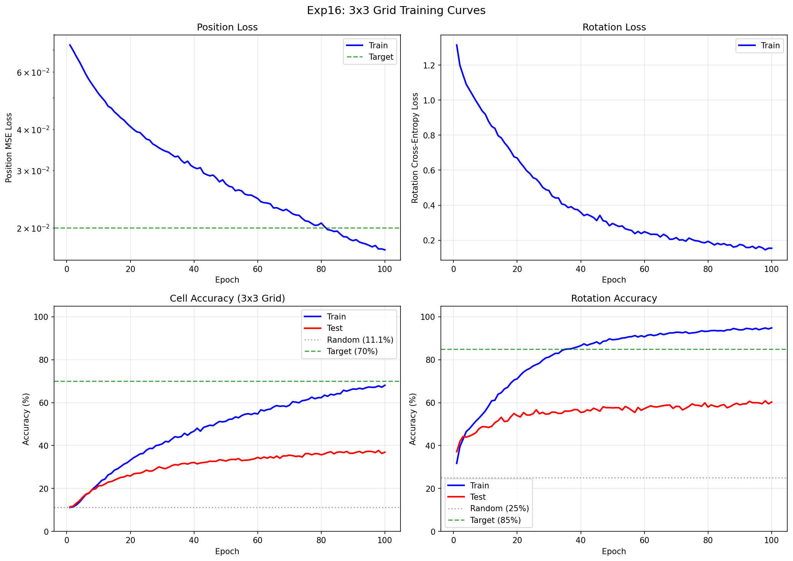
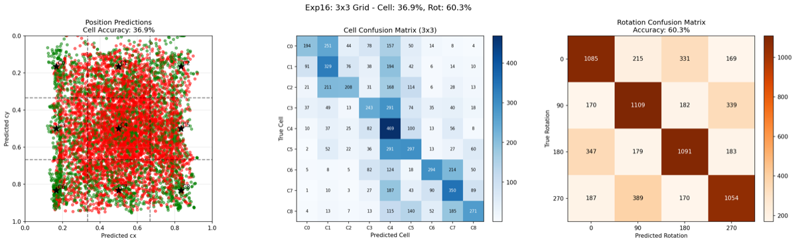
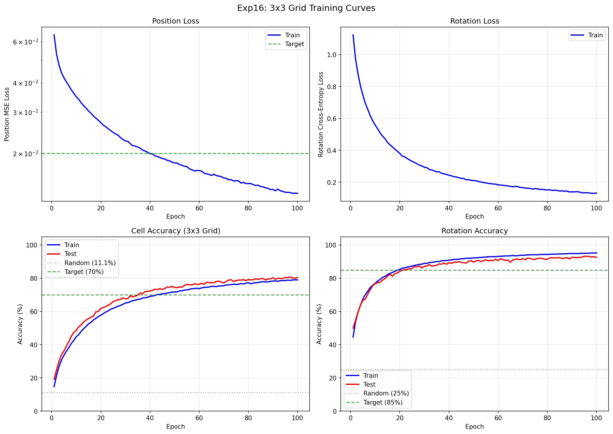
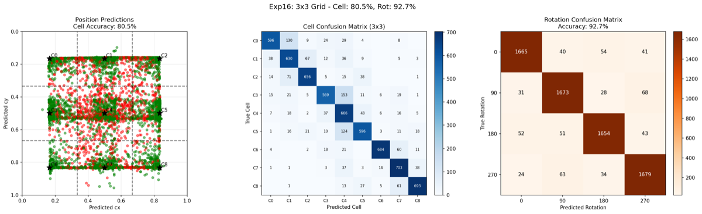

# Experiment 17: 3x3 Grid with More Data

## Objective

Scale up training data from 500 to 10,000 puzzles to reduce overfitting observed in exp16. Test whether increased puzzle diversity improves generalization for 3x3 grid position prediction.

**Key Questions:**
1. Does 20× more puzzles reduce the train-test gap?
2. How does cells_per_puzzle affect learning?
3. Can we match or exceed exp16's 39.1% test cell accuracy?

## Background

### Exp16 Results (Baseline)

Exp16 achieved on 3x3 grid with 500 puzzles:
- **39.1% test cell accuracy** (3.5× random baseline of 11.1%)
- **60.9% test rotation accuracy**
- **11.1% cell gap**, **30.1% rotation gap** (significant overfitting)

### This Experiment

Scale up data while keeping the same architecture:
- Training puzzles: 500 → **10,000** (20× increase)
- Configurable cells_per_puzzle (1-9) to control samples/epoch
- Backbone: ShuffleNetV2_x0.5 (same as exp16)

## Experiment Design

### Model Architecture

| Component | Details |
|-----------|---------|
| Backbone | ShuffleNetV2_x0.5 (1024-dim features) |
| Position Head | Spatial Correlation |
| Rotation Head | Rotation Correlation (3x3 grid extraction) |
| Total Parameters | 1,580,388 |

### Training Configuration

| Parameter | Value |
|-----------|-------|
| Training puzzles | 10,000 |
| Test puzzles | 200 |
| Input Size | Piece: 128×128, Puzzle: 256×256 |
| Loss | MSE (position) + CrossEntropy (rotation) |
| Optimizer | AdamW |
| Learning rates | Backbone: 1e-4, Heads: 1e-3 |
| Batch Size | 64 |
| Epochs | 100 |

## Results

### Run 1: 1 Cell per Puzzle

**Configuration:** 10,000 puzzles × 1 cell = 10,000 samples/epoch

| Metric | Train | Test | Gap |
|--------|-------|------|-----|
| Cell Accuracy | 68.1% | **36.9%** | 31.2% |
| Rotation Accuracy | 94.8% | **60.3%** | 34.6% |

- Best model: epoch 98 with **37.7%** test cell accuracy
- Training time: 2.4 hours (~85s/epoch)

#### Training Curves



#### Test Predictions



**Finding:** More puzzles with 1 cell/puzzle made overfitting *worse*, not better. The model never sees all 9 cells of a puzzle together, preventing it from learning that cells within the same puzzle share visual features.

---

### Run 2: 9 Cells per Puzzle

**Configuration:** 10,000 puzzles × 9 cells = 90,000 samples/epoch

| Metric | Train | Test | Gap |
|--------|-------|------|-----|
| Cell Accuracy | 79.0% | **80.5%** | -1.4% |
| Rotation Accuracy | 95.2% | **92.7%** | 2.6% |

- Best model: epoch 97 with **80.9%** test cell accuracy
- Training time: 16.7 hours (~600s/epoch)

#### Training Curves



#### Test Predictions



### Comparison Across All Runs

| Experiment | Puzzles | Cells/puzzle | Samples/epoch | Test Cell | Test Rot | Cell Gap |
|------------|---------|--------------|---------------|-----------|----------|----------|
| Exp16 | 500 | 9 | 4,500 | 39.1% | 60.9% | 11.1% |
| Exp17 Run 1 | 10,000 | 1 | 10,000 | 37.7% | 60.3% | 31.2% |
| **Exp17 Run 2** | **10,000** | **9** | **90,000** | **80.9%** | **92.7%** | **-1.4%** |

### Success Criteria Check

| Criterion | Target | Result | Status |
|-----------|--------|--------|--------|
| Reduce train-test gap | < 11.1% | -1.4% (cell), 2.6% (rot) | **PASS** |
| Exceed exp16 cell accuracy | > 39.1% | 80.9% | **PASS** |
| Exceed exp16 rotation accuracy | > 60.9% | 92.7% | **PASS** |

## Analysis

### Why 1 Cell/Puzzle Failed (Run 1)

With 1 cell per puzzle per epoch:
- Each puzzle-cell combination seen only once per epoch
- Different cells from same puzzle never seen together
- Model memorizes puzzle-specific patterns rather than learning generalizable matching
- Result: **worse overfitting** than exp16 (31.2% gap vs 11.1%)

### Why 9 Cells/Puzzle Succeeded (Run 2)

With 9 cells per puzzle:
- All 9 cells from each puzzle seen together each epoch
- Model learns that cells within the same puzzle share visual features
- Combined with 10,000 puzzles: maximum diversity + proper feature learning
- Result: **no overfitting** (test accuracy slightly exceeds train!)

### Key Insight: Data Quantity AND Quality Matter

The experiment revealed that **how** you use data matters as much as **how much** data you have:

| Factor | Run 1 (Failed) | Run 2 (Succeeded) |
|--------|----------------|-------------------|
| Puzzle diversity | 10,000 ✓ | 10,000 ✓ |
| Cell relationship learning | ✗ | ✓ |
| Samples per epoch | 10,000 | 90,000 |
| Overfitting | Severe (31%) | None (-1%) |

### Comparison with Exp13 (2x2 Grid)

| Metric | Exp13 (2×2, 4 cells) | Exp17 Run 2 (3×3, 9 cells) |
|--------|----------------------|----------------------------|
| Test position | 86.3% | 80.9% |
| Test rotation | 92.8% | 92.7% |
| Random baseline | 25% | 11.1% |
| Relative accuracy | 3.45× baseline | **7.3× baseline** |

Despite having 2.25× more classes (9 vs 4), exp17 achieves comparable absolute accuracy and **much better relative accuracy** compared to random baseline.

## Conclusion

**The experiment is a SUCCESS.**

### Achievements

1. **Doubled cell accuracy**: 39.1% → 80.9% (+41.8 percentage points)
2. **Increased rotation accuracy**: 60.9% → 92.7% (+31.8 percentage points)
3. **Eliminated overfitting**: 11.1% gap → -1.4% gap (test > train!)
4. **Matched exp13's 2x2 performance** on a harder 3x3 task

### Key Findings

1. **Data scaling works**: 20× more puzzles dramatically improved generalization
2. **Cell sampling matters**: Must see all cells per puzzle together for proper learning
3. **Architecture validated**: ShuffleNetV2_x0.5 + rotation correlation scales to 3x3 grid
4. **No architectural changes needed**: Same model, just more data

### Recommendations

1. **For 3x3 grid**: Use 10,000+ puzzles with all 9 cells per puzzle
2. **For faster experiments**: Can use fewer puzzles but must keep all cells
3. **Next steps**: Scale to 4x4 grid (16 cells) or continuous coordinate regression

## File Structure

```
experiments/exp17_3x3_more_data/
├── README.md           # This file
├── __init__.py         # Package marker
├── dataset.py          # Dataset with configurable cells_per_puzzle
├── model.py            # FastBackboneModel with 3x3 grid support
├── train.py            # Training script with checkpoint saving
├── visualize.py        # Visualization utilities
├── lr_finder.py        # Learning rate finder utility
├── outputs_run1/       # Run 1: 1 cell per puzzle
│   ├── results.json
│   ├── checkpoint_best.pt
│   ├── checkpoint_last.pt
│   ├── test_predictions.png
│   └── training_curves.png
└── outputs/            # Run 2: 9 cells per puzzle
    ├── results.json
    ├── checkpoint_best.pt
    ├── checkpoint_last.pt
    ├── test_predictions.png
    └── training_curves.png
```

## Usage

```bash
cd network
source ../venv/bin/activate

# Run with 1 cell per puzzle (fast, ~2.5 hours)
python -m experiments.exp17_3x3_more_data.train --epochs 100 --cells-per-puzzle 1

# Run with 9 cells per puzzle (thorough, ~16.5 hours)
python -m experiments.exp17_3x3_more_data.train --epochs 100 --cells-per-puzzle 9

# Custom parameters
python -m experiments.exp17_3x3_more_data.train \
    --epochs 100 \
    --n-train 10000 \
    --n-test 200 \
    --cells-per-puzzle 9 \
    --batch-size 64
```

## Relationship to Previous Experiments

```
exp13 (5K puzzles, 2x2)     -> 86% quad, 93% rot (BEST 2x2 RESULT)
        |
exp15 (fast backbone)       -> ShuffleNetV2 identified as fastest
        |
exp16 (500 puzzles, 3x3)    -> 39% cell, 61% rot (baseline for 3x3)
        |
exp17 Run 1 (10K, 1 cell)   -> 38% cell, 60% rot (more overfitting!)
        |
exp17 Run 2 (10K, 9 cells)  -> 81% cell, 93% rot (SUCCESS!)
        |
        v
exp18 (planned)             -> 4x4 grid or continuous regression?
```
