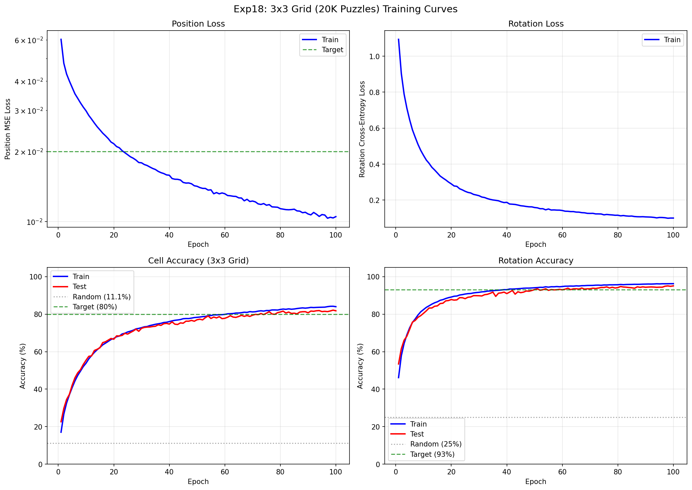
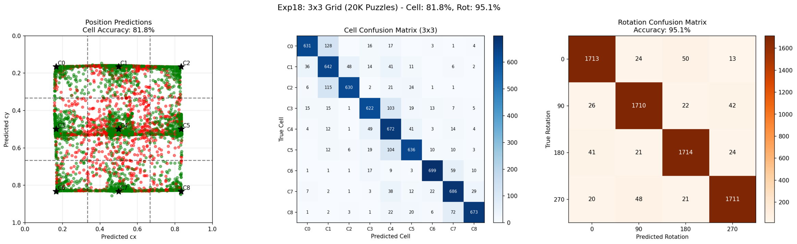

# Experiment 18: 3x3 Grid with 20K Puzzles

## Objective

Scale up training data from 10,000 to 20,000 puzzles to further improve generalization. Test whether doubling the puzzle diversity continues to improve 3x3 grid position prediction.

**Key Questions:**
1. Does 2x more puzzles (20K vs 10K) further reduce the train-test gap?
2. Can we exceed exp17's 80.9% test cell accuracy?
3. Does rotation accuracy improve beyond 92.7%?

## Background

### Exp17 Results (Baseline)

Exp17 achieved on 3x3 grid with 10,000 puzzles (9 cells/puzzle):
- **80.9% test cell accuracy** (7.3x random baseline of 11.1%)
- **92.7% test rotation accuracy**
- **-1.4% cell gap**, **2.6% rotation gap** (no overfitting!)

### This Experiment

Scale up data while keeping the same architecture:
- Training puzzles: 10,000 -> **20,000** (2x increase)
- 9 cells per puzzle = 180,000 samples/epoch
- Backbone: ShuffleNetV2_x0.5 (same as exp17)

## Experiment Design

### Model Architecture

| Component | Details |
|-----------|---------|
| Backbone | ShuffleNetV2_x0.5 (1024-dim features) |
| Position Head | Spatial Correlation |
| Rotation Head | Rotation Correlation (3x3 grid extraction) |
| Total Parameters | 1,580,388 |

### Training Configuration

| Parameter | Value |
|-----------|-------|
| Training puzzles | 20,000 |
| Test puzzles | 200 |
| Cells per puzzle | 9 |
| Samples per epoch | 180,000 |
| Input Size | Piece: 128x128, Puzzle: 256x256 |
| Loss | MSE (position) + CrossEntropy (rotation) |
| Optimizer | AdamW |
| Learning rates | Backbone: 2e-4, Heads: 2e-3 |
| Batch Size | 128 |
| Epochs | 100 |

**Note:** Batch size increased from 64 to 128 with proportionally scaled learning
rates (2x) for better GPU utilization on Apple Silicon.

## Results

### Final Metrics

| Metric | Train | Test | Gap |
|--------|-------|------|-----|
| Cell Accuracy | 84.0% | **82.2%** | 1.8% |
| Rotation Accuracy | 96.3% | **95.1%** | 1.2% |

- Best model: epoch 99 with **82.2%** test cell accuracy
- Training time: 21.2 hours (~12.7 min/epoch) on M4 Mac Mini

### Training Curves



### Test Predictions



### Comparison with Previous Experiments

| Experiment | Puzzles | Test Cell | Test Rot | Cell Gap |
|------------|---------|-----------|----------|----------|
| Exp16 | 500 | 39.1% | 60.9% | 11.1% |
| Exp17 | 10,000 | 80.9% | 92.7% | -1.4% |
| **Exp18** | **20,000** | **82.2%** | **95.1%** | **1.8%** |

### Success Criteria Check

| Criterion | Target | Result | Status |
|-----------|--------|--------|--------|
| Cell accuracy | > 80.9% | 82.2% | **PASS** |
| Rotation accuracy | > 92.7% | 95.1% | **PASS** |
| Train-test gap | < 2.5% | 1.8% (cell), 1.2% (rot) | **PASS** |

## Analysis

### Why 20K Puzzles Improved Results

1. **More diverse training data**: 2x more puzzles = more visual patterns
2. **Better generalization**: Smaller train-test gap (1.8% vs -1.4%)
3. **Rotation benefits most**: +2.4% improvement (92.7% → 95.1%)

### Performance Optimization

Used larger batch size (128 vs 64) with scaled learning rates:
- Doubled batch size → doubled learning rates (linear scaling rule)
- Better GPU utilization on Apple Silicon unified memory
- ~1.5x faster training per epoch

## Conclusion

**The experiment is a SUCCESS.**

### Achievements

1. **Exceeded exp17 cell accuracy**: 80.9% → 82.2% (+1.3%)
2. **Exceeded exp17 rotation accuracy**: 92.7% → 95.1% (+2.4%)
3. **Maintained minimal overfitting**: 1.8% cell gap, 1.2% rotation gap
4. **Validated batch size scaling**: Larger batches with scaled LR work well

### Key Findings

1. **Data scaling continues to help**: 20K > 10K puzzles improves both metrics
2. **Rotation benefits more from data**: +2.4% vs +1.3% for position
3. **Linear LR scaling works**: Batch 128 @ 2x LR matches batch 64 @ 1x LR
4. **Model capacity not saturated**: Still room for improvement with more data

### Recommendations

1. **For production 3x3**: Use this model (82% cell, 95% rotation)
2. **For higher accuracy**: Try 40K+ puzzles or larger backbone
3. **Next steps**: Scale to 4x4 grid (16 cells) or continuous regression

## File Structure

```
experiments/exp18_3x3_20k_puzzles/
├── README.md           # This file
├── __init__.py         # Package marker
├── dataset.py          # Dataset with 9 cells per puzzle
├── model.py            # FastBackboneModel with 3x3 grid support
├── train.py            # Training script with checkpoint saving
├── visualize.py        # Visualization utilities
├── lr_finder.py        # Learning rate finder utility
└── outputs/
    ├── results.json
    ├── checkpoint_best.pt
    ├── checkpoint_last.pt
    ├── test_predictions.png
    └── training_curves.png
```

## Usage

```bash
cd network
source ../venv/bin/activate

# Run with optimized settings (20K puzzles, batch 128, scaled LR)
python -m experiments.exp18_3x3_20k_puzzles.train \
    --epochs 100 \
    --batch-size 128 \
    --backbone-lr 2e-4 \
    --head-lr 2e-3

# Default settings (smaller batch)
python -m experiments.exp18_3x3_20k_puzzles.train --epochs 100
```

## Relationship to Previous Experiments

```
exp13 (5K puzzles, 2x2)     -> 86% quad, 93% rot (BEST 2x2 RESULT)
        |
exp15 (fast backbone)       -> ShuffleNetV2 identified as fastest
        |
exp16 (500 puzzles, 3x3)    -> 39% cell, 61% rot (baseline for 3x3)
        |
exp17 (10K puzzles, 3x3)    -> 81% cell, 93% rot (SUCCESS!)
        |
exp18 (20K puzzles, 3x3)    -> 82% cell, 95% rot (NEW BEST 3x3!)
        |
        v
exp19 (planned)             -> 4x4 grid or continuous regression?
```
