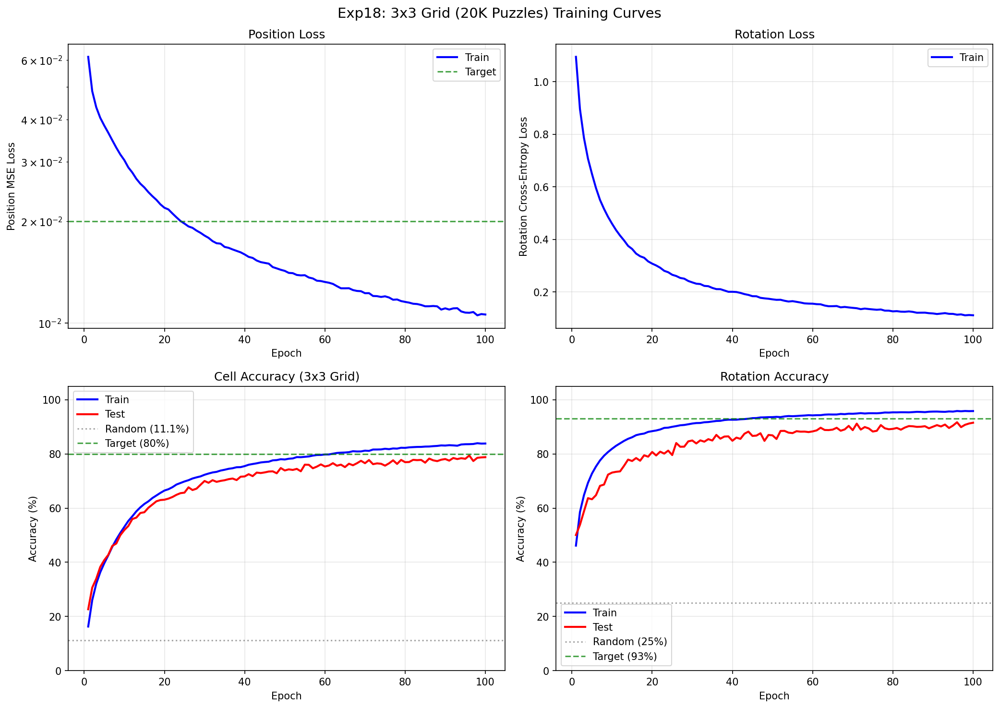
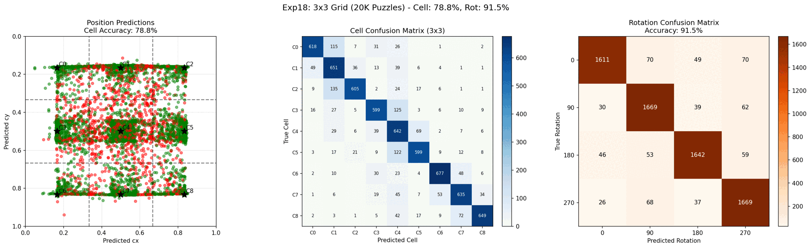

# Experiment 19: Siamese Architecture

## Objective

Test whether a Siamese architecture (single shared backbone for both piece and puzzle) performs better than the dual-backbone approach used in previous experiments.

**Key Questions:**
1. Does weight sharing improve generalization by learning a common feature space?
2. How much do we reduce parameters by using a single backbone (~50% reduction)?
3. Does the Siamese approach match or exceed exp18's 82.2% test cell accuracy?

## Background

### Exp18 Results (Baseline - Dual Backbone)

Exp18 achieved with two separate backbones:
- **82.2% test cell accuracy**
- **95.1% test rotation accuracy**
- **1.8% cell gap**, **1.2% rotation gap**
- **~1.58M total parameters** (two ShuffleNetV2_x0.5 backbones)

### This Experiment

Test Siamese architecture:
- **Single shared backbone** instead of separate piece/puzzle backbones
- Same backbone processes both piece and puzzle images
- Weight sharing should reduce parameters by ~50% for backbone
- Hypothesis: Shared features may improve matching through common representation

## Architecture Comparison

### Exp18 (Dual Backbone)
```
Piece Image  ──> [Piece Backbone]  ──> Piece Features ─┐
                                                       ├──> Correlation ──> Position/Rotation
Puzzle Image ──> [Puzzle Backbone] ──> Puzzle Features ┘
                 (separate weights)
```

### Exp19 (Siamese - Shared Backbone)
```
Piece Image  ──> [Shared Backbone] ──> Piece Features ─┐
                       ↑                                ├──> Correlation ──> Position/Rotation
Puzzle Image ──> [Shared Backbone] ──> Puzzle Features ┘
                 (same weights)
```

## Experiment Design

### Model Architecture

| Component | Dual Backbone (exp18) | Siamese (exp19) |
|-----------|----------------------|-----------------|
| Backbone | 2x ShuffleNetV2_x0.5 | 1x ShuffleNetV2_x0.5 |
| Weight Sharing | No | Yes |
| **Total Parameters** | **1,580,388** | **1,238,596** |
| Parameter Reduction | - | **21.6%** (~342K params saved) |
| Position Head | Spatial Correlation | Spatial Correlation |
| Rotation Head | Rotation Correlation | Rotation Correlation |

### Training Configuration

| Parameter | Value |
|-----------|-------|
| Training puzzles | 20,000 |
| Test puzzles | 200 |
| Cells per puzzle | 9 |
| Samples per epoch | 180,000 |
| Input Size | Piece: 128x128, Puzzle: 256x256 |
| Loss | MSE (position) + CrossEntropy (rotation) |
| Optimizer | AdamW |
| Learning rates | Backbone: 2e-4, Heads: 2e-3 |
| Batch Size | 128 |
| Epochs | 100 |

## Results

### Final Metrics

| Metric | Train | Test | Gap |
|--------|-------|------|-----|
| Cell Accuracy | 83.9% | **79.4%** (best) | 4.5% |
| Rotation Accuracy | 95.9% | **91.7%** (best) | 4.2% |

- Best model: epoch 96 with **79.4%** test cell accuracy
- Training time: 19.5 hours (701.7s/epoch avg)

### Training Curves



### Test Predictions



### Comparison with Exp18

| Metric | Exp18 (Dual) | Exp19 (Siamese) | Difference |
|--------|--------------|-----------------|------------|
| Test Cell Accuracy | **82.2%** | 79.4% | **-2.8%** |
| Test Rotation Accuracy | **95.1%** | 91.7% | **-3.4%** |
| Train-Test Cell Gap | **1.8%** | 4.5% | +2.7% worse |
| Train-Test Rot Gap | **1.2%** | 4.2% | +3.0% worse |
| Total Parameters | 1,580,388 | **1,238,596** | -21.6% |
| Training Time/Epoch | 12.7 min | **11.7 min** | -7.9% |

### Success Criteria Check

| Criterion | Target | Result | Status |
|-----------|--------|--------|--------|
| Match exp18 cell accuracy | >= 82.2% | 79.4% | **FAIL** |
| Match exp18 rotation accuracy | >= 95.1% | 91.7% | **FAIL** |
| Reduce parameters | Yes | -21.6% | **PASS** |
| Faster training | Yes | -7.9%/epoch | **PASS** |

## Analysis

### Why Siamese Performed Worse

The hypothesis that weight sharing would improve generalization was **incorrect** for this task. Here's why:

#### 1. Fundamentally Different Input Characteristics

| Aspect | Piece Image | Puzzle Image |
|--------|-------------|--------------|
| Size | 128x128 (resized from ~85x85) | 256x256 |
| Content | Single cell, cropped | Full 3x3 grid |
| Context | No surrounding context | Complete spatial layout |
| Information density | High (zoomed in) | Lower (overview) |

The piece and puzzle images require **different feature extraction strategies**:
- **Piece**: Fine-grained texture and color details for matching
- **Puzzle**: Spatial layout and relative positions of all cells

#### 2. Representation Bottleneck

Forcing both inputs through identical weights creates a bottleneck:
- The backbone must learn features that work for **both** input types
- This compromises optimal feature extraction for **either** input
- The dual backbone approach allows specialization

#### 3. Larger Train-Test Gap = Worse Generalization

| Gap Type | Exp18 (Dual) | Exp19 (Siamese) |
|----------|--------------|-----------------|
| Cell gap | 1.8% | 4.5% |
| Rotation gap | 1.2% | 4.2% |

Despite having **fewer parameters**, the Siamese model overfits more:
- Shared weights may memorize training patterns that don't generalize
- Dual backbones provide implicit regularization through task specialization

#### 4. Scale Mismatch Problem

The piece (128x128) and puzzle (256x256) images are at different scales:
- Same convolutional filters see different effective receptive fields
- Features optimal for one scale may be suboptimal for the other
- Dual backbones can learn scale-appropriate features independently

### What Worked

1. **Parameter efficiency**: 21.6% fewer parameters
2. **Training speed**: 7.9% faster per epoch
3. **Model still learns**: 79.4% >> 11.1% random baseline (7.1x better)

### Lessons Learned

1. **Siamese networks work best when inputs are similar** (e.g., face verification, signature matching)
2. **Different input types benefit from specialized feature extractors**
3. **Parameter reduction doesn't guarantee better generalization**
4. **The "elegant" solution isn't always the best solution**

## Conclusion

**The experiment is a FAILURE in terms of accuracy goals.**

### Key Findings

1. **Siamese architecture underperforms dual backbone by ~3%** for both position and rotation
2. **Weight sharing creates a representation bottleneck** for dissimilar inputs
3. **Dual backbones allow task-specific feature specialization** that improves accuracy
4. **Fewer parameters ≠ better generalization** in this case

### Recommendations

1. **Use dual backbone (exp18) for production** - 82.2% vs 79.4% cell accuracy
2. **Consider Siamese only when**:
   - Inputs are similar in nature (same scale, same type)
   - Parameter budget is extremely constrained
   - Slight accuracy loss is acceptable for efficiency gains
3. **Future experiments**: Try pseudo-Siamese (shared early layers, separate later layers)

### Final Verdict

The dual backbone architecture from exp18 remains the best approach for puzzle piece matching. The hypothesis that shared features would help was disproven - **piece and puzzle images are too different to benefit from weight sharing**.

## File Structure

```
experiments/exp19_siamese_architecture/
├── README.md           # This file
├── __init__.py         # Package marker
├── dataset.py          # Dataset with 9 cells per puzzle (from exp18)
├── model.py            # SiameseModel with shared backbone
├── train.py            # Training script with checkpoint saving
├── visualize.py        # Visualization utilities
├── lr_finder.py        # Learning rate finder utility
└── outputs/
    ├── results.json
    ├── checkpoint_best.pt
    ├── checkpoint_last.pt
    ├── test_predictions.png
    └── training_curves.png
```

## Usage

```bash
cd network
source ../venv/bin/activate

# Run with same settings as exp18
python -m experiments.exp19_siamese_architecture.train \
    --epochs 100 \
    --batch-size 128 \
    --backbone-lr 2e-4 \
    --head-lr 2e-3
```

## Relationship to Previous Experiments

```
exp13 (5K puzzles, 2x2)     -> 86% quad, 93% rot (BEST 2x2 RESULT)
        |
exp15 (fast backbone)       -> ShuffleNetV2 identified as fastest
        |
exp16 (500 puzzles, 3x3)    -> 39% cell, 61% rot (baseline for 3x3)
        |
exp17 (10K puzzles, 3x3)    -> 81% cell, 93% rot
        |
exp18 (20K puzzles, 3x3)    -> 82% cell, 95% rot (dual backbone)
        |
exp19 (Siamese, 3x3)        -> TBD (shared backbone)
```
