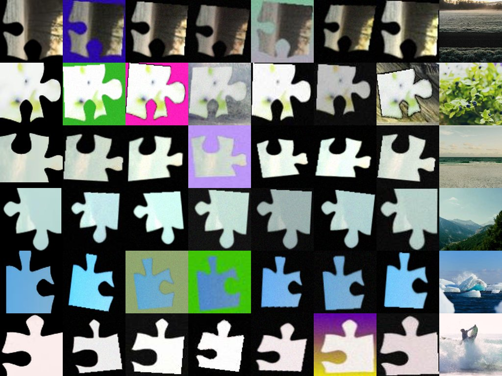

# Experiment 26: Domain Randomization to Survive Real Photos

## Objective

Beat **76.7% both-correct on north_star v1** — the zero-training SIFT→NCC
hybrid's score — with a *trained* model. exp25 showed the exp20 CNN
collapses from 72.2% both-correct on the synthetic benchmark to **14.8%**
on real photos, because the synthetic "piece" is a byte-exact crop of the
very image fed as the puzzle: matching by raw pixels is enough, so the CNN
never learned appearance-invariant matching. exp26 rewrites the training
piece so the pixel shortcut no longer works (critical-review item #5).

## Method

Same architecture, model, frozen split and methodology harness as exp20
(`FastBackboneModel` / ShuffleNetV2_x0.5, val-based checkpoint selection,
synthetic test touched once). The **only** change is the training data
path: pieces are generated and stored as **RGBA** (alpha = true piece
mask), then pushed through `augment.py` with an **independently jittered
puzzle**. Nothing about val/test changes — they are the same
black-composited pieces as exp20, so those numbers stay comparable.

### Augmentations (each individually toggleable — `AugmentConfig`)

| Augmentation | What it does | Why (real-photo gap it closes) |
| --- | --- | --- |
| **Independent photometric** | Brightness/contrast/saturation/hue drawn **separately** for piece and puzzle (puzzle milder) | The core lever. Identical jitter keeps pixel-identity; independent jitter destroys the shortcut. |
| **Scale jitter** | Piece resized ±15% | Photographed pieces have unknown scale vs the box art. |
| **Perspective** | Mild random homography on the piece | Hand-held camera is not fronto-parallel. |
| **Rotation jitter** | ±8° around each 90° candidate (label stays 4-class) | Pieces are never placed at an exact 90°. |
| **Realistic background** | RGBA piece composited on black / solid / gradient / another puzzle's texture | Deployed rembg output is black (kept as the majority mode); textured modes teach robustness to segmentation leakage. |
| **Mask halo** | Alpha randomly eroded/dilated a few px before compositing | rembg masks are imperfect (edge eaten or background ring bleeds in). |
| **Sensor noise** | Additive Gaussian noise | Camera sensor / ISO grain. |
| **JPEG** | Random-quality JPEG recompression | Phone photos are JPEG, box scans are JPEG. |

Backgrounds are procedural or crops of **other training puzzles** — never
the north-star photos, so the real-photo benchmark stays untouched.



*Contact sheet (`visualize_augmentations.py`): col 0 = black-composited
original piece, cols 1–6 = independent augmentation draws, last col = the
(independently jittered) box art. Note the piece and puzzle photometrics
differ — that is the anti-shortcut.*

### Ablation

`--aug-preset` selects a preset that disables one augmentation family so
its marginal contribution is measurable against `full`:
`none`, `no_photometric`, `no_geometry`, `no_background`, `no_sensor`,
`photometric_only`. Individual `--no-*` flags override any preset.

## How to run

**Local (design verification only — M4):**

```bash
cd network
# tiny RGBA set for a few split puzzles, then eyeball the augmentations
uv run python -m experiments.exp26_domain_randomization.visualize_augmentations \
    --dataset-root datasets/realistic_4x4_rgba \
    --puzzle-root datasets/puzzles
```

**Training (RunPod — the real run):** RGBA generation and 50-epoch
training happen on the pod (generation is CPU-parallel and resumable, so
GPU-hours aren't spent decoding Beziers).

```bash
cd network/experiments/exp26_domain_randomization
./runpod/prepare_package.sh          # code + frozen split + source puzzles
# scp runpod_package_exp26/runpod_training.tar.gz to the pod, then:
#   cd /workspace && tar -xzf runpod_training.tar.gz && ./setup_and_train.sh
```

**North-star evaluation (ONCE, after training):**

```bash
cd network
uv run python experiments/exp25_north_star_eval/evaluate.py \
    --dataset-root datasets/north_star/v1 \
    --checkpoint experiments/exp26_domain_randomization/outputs/domain_randomization/checkpoint_best_state_dict.pt
```

`train.py` exports `checkpoint_best_state_dict.pt` (a raw state_dict)
alongside the harness `checkpoint_best.pt` specifically so the north-star
evaluator loads it without any format juggling.

## North-star discipline

north_star is **test-only**: the checkpoint is selected on the synthetic
`val` split, the synthetic `test` split is touched once (`--eval-test`),
and the real-photo benchmark is evaluated exactly once at the very end.
Known limitation: there is no *real* validation set, so the checkpoint is
selected on clean synthetic val — a model that generalizes to photos may
not be the one that peaks on clean val. This is inherent to the north-star
discipline and is called out here rather than worked around.

## Results

Trained on RunPod (RTX 4090, 50 epochs, batch 128, 2.2 h; full `full`
preset). Training curves are textbook: train and val overlap for all 50
epochs (under domain randomization the model cannot memorize appearance),
and both were still improving at epoch 50 (best = epoch 50).

### Synthetic benchmark (frozen split, test touched once)

| Model | Cell | Rotation | Both |
| --- | --- | --- | --- |
| **exp26 (domain randomization)** | **76.4%** | **99.0%** | **76.2%** |
| exp20 (same arch, no DR) | 72.9% | 94.6% | 72.2% |
| Classical floor (exp23 hybrid) | 82.9% | 90.3% | 82.2% |

Domain randomization **helped** the synthetic benchmark (+4.0 both,
rotation near ceiling at 99.0%) — making the task harder acted as a
regularizer. Still 6 points below the classical floor on synthetic.

### North-star real photos (touched ONCE) — **FAILED**

| Method | Cell | Rotation | Both |
| --- | --- | --- | --- |
| SIFT→NCC hybrid (bar) | 77.9% | 89.2% | **76.7%** |
| **CNN exp26 (DR)** | 22.3% | 33.5% | **12.7%** |
| CNN exp26 + rot search | 23.3% | 34.6% | 13.8% |
| CNN exp20 (no DR) | 22.4% | 44.0% | 14.8% |

**Domain randomization transferred nothing to real photos** (12.7% vs
exp20's 14.8% — noise-level identical) despite lifting synthetic accuracy
on every metric. Diagnostics from `outputs/north_star_results.json`:

- **Not grid mismatch**: on the 4x4-only puzzle subset (the trained
  geometry) the CNN scores 11.5% both — no better than overall.
- **Not backgrounds**: uniform 10–14% both across all four capture
  backgrounds.
- **Rotation is spurious-cue driven**: the confusion matrix is not
  diffuse — the model predicts 90°/270° for everything (28–53% per row)
  and almost never 0°/180°, i.e. its rotation features latch onto an
  artifact that photographed pieces don't carry.

### Interpretation

The sim-to-real gap for this CNN family does **not** live in the nuisance
factors we randomized (photometry, scale, perspective, small rotations,
backgrounds, mask error, noise, JPEG). All augmentations are
transformations of the *same digital pixels*; a photographed physical
piece differs more fundamentally — printed halftone texture, glossy
reflectance, embossed cardboard relief, camera optics/ISP, and a
photographed (not digital) box art as the overview. SIFT survives because
it matches local gradient geometry; the learned features do not encode
anything that survives the print-and-photograph transform.

Consequences (exp27 candidates, in expected-value order):

1. **Pretrained robust features** (critical-review item #8): frozen
   DINOv2/LoFTR-style encoder under the existing correlation head — these
   representations are trained on real photos and are known to survive
   appearance shifts.
2. **Real-capture fine-tuning data**: even a few hundred photographed
   pieces (train-split puzzles only, never north_star) may matter more
   than any synthetic augmentation.
3. **Print-and-photograph simulation**: model the actual transform
   (halftone, specular gloss, 3D emboss lighting, camera ISP) rather than
   generic photometric jitter.
4. **Ship the classical hybrid meanwhile** (unchanged exp25 conclusion):
   the backend's CNN path remains far below the zero-training hybrid on
   the real task.

## Files

- `augment.py` — toggleable domain-randomization augmentations + presets
- `aug_dataset.py` — RGBA train dataset + black-composite eval datasets
  over the exp20 frozen split
- `generate_dataset.py` — RGBA piece generator (parallel, resumable)
- `train.py` — training entry point (reuses the exp20 harness)
- `visualize_augmentations.py` — contact-sheet renderer
- `runpod/` — `prepare_package.sh` + `setup_and_train.sh`
