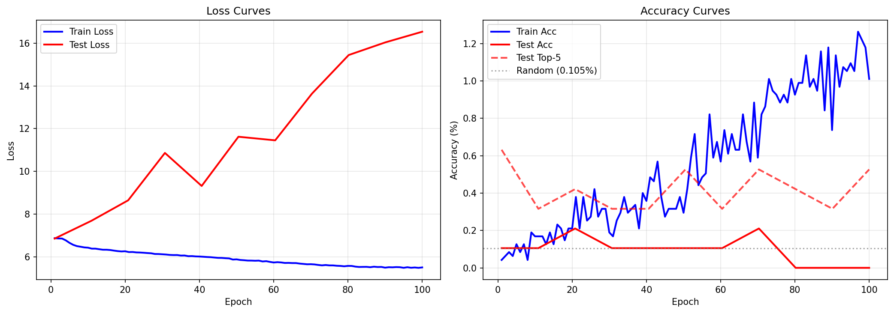
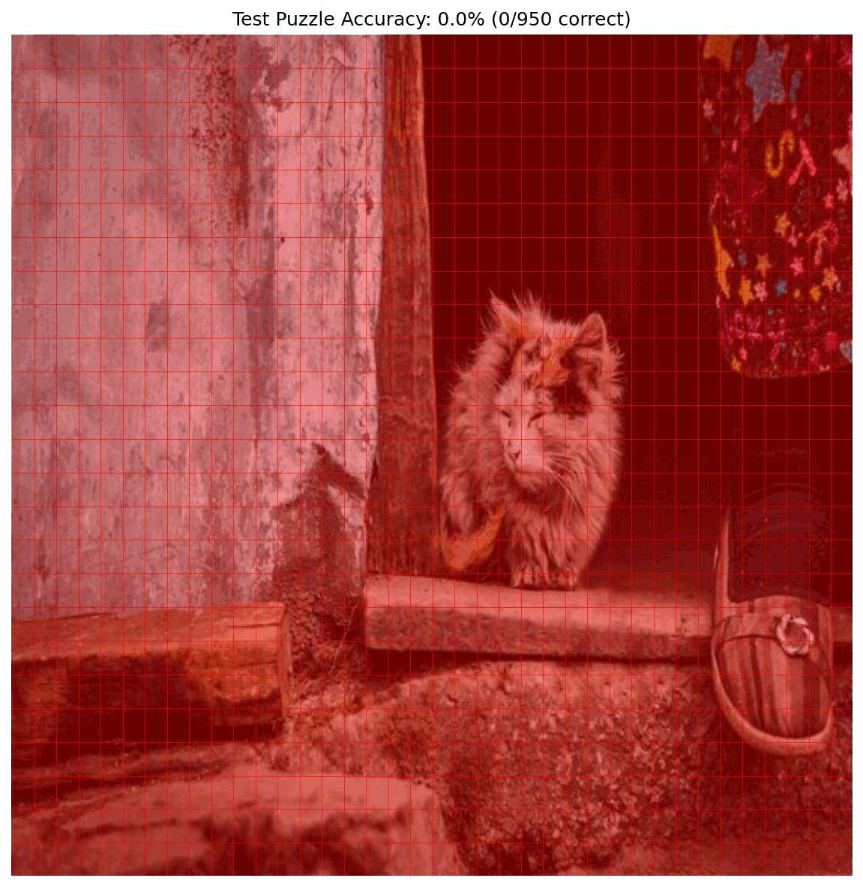

# Experiment 6: Multi-Puzzle Training with Higher Resolution

## Objective

Test whether training on **multiple puzzles simultaneously** with **higher resolution** puzzle images enables cross-puzzle generalization.

**Key Questions**:
1. Can multi-puzzle training force the model to learn puzzle-invariant matching features?
2. Does higher puzzle resolution (512x512 vs 256x256) provide enough detail for matching?
3. Can we achieve meaningful accuracy on a held-out puzzle?

## Background

### Experiment 5 Results

Exp5 tested cross-puzzle generalization with a dual-input architecture (piece + puzzle):

| Metric | Training (puzzle_001) | Test (puzzle_002) |
|--------|----------------------|-------------------|
| Top-1 Accuracy | 11.47% | 0.11% |
| Top-5 Accuracy | 36.32% | 0.53% |

**Test accuracy equaled random chance (0.105%)**, indicating complete failure to generalize.

### Identified Issues from Exp5

1. **Resolution mismatch**: Cells in 256x256 puzzle are only ~7x10 pixels - too small to discriminate
2. **Single-puzzle training**: No variation in puzzle context during training
3. **Memorization over matching**: Model learned puzzle_001-specific patterns

## Experiment Design

### Key Changes from Exp5

| Aspect | Exp5 | Exp6 (This Experiment) |
|--------|------|------------------------|
| Training puzzles | 1 | 5 (puzzle_001 to puzzle_005) |
| Puzzle resolution | 256x256 | 512x512 |
| Cell detail | ~7x10 px | ~13x20 px |
| Piece resolution | 64x64 | 64x64 (unchanged) |
| Test puzzle | puzzle_002 (seen during training) | puzzle_006 (completely held out) |
| Training diversity | None | 5 different puzzle images |

### Architecture

Same dual-input architecture as exp5, but modified for higher resolution:

```
DualInputCellClassifier (Multi-Puzzle, High-Res)
├── Shared CNN Backbone
│   ├── Conv2D(3→32, stride=2) + BN + ReLU   → H/2
│   ├── Conv2D(32→64, stride=2) + BN + ReLU  → H/4
│   ├── Conv2D(64→128, stride=2) + BN + ReLU → H/8
│   ├── Conv2D(128→256, stride=2) + BN + ReLU → H/16
│   └── Conv2D(256→256, stride=2) + BN + ReLU → H/32 (extra layer for 512x512)
├── Spatial Correlation Module
├── Cross-Attention Fusion
└── Classification Head (950 cells)
```

For 512x512 puzzle: 512 → 256 → 128 → 64 → 32 → 16 feature map
For 64x64 piece: 64 → 32 → 16 → 8 → 4 → 2 feature map

### Training Strategy

1. **Combined dataset**: Merge pieces from 5 puzzles (puzzle_001 to puzzle_005)
2. **Paired loading**: Each piece is paired with its corresponding puzzle image
3. **Unified cell grid**: All puzzles share the same 38x25 = 950 cell structure
4. **Validation**: Evaluate on held-out puzzle_006 after each epoch

### Success Criteria

| Metric | Target | Meaning |
|--------|--------|---------|
| Training accuracy | >90% | Model uses both inputs effectively |
| Test accuracy (puzzle_006) | >10% | 100x above random chance (0.105%) |
| Test top-5 accuracy | >30% | Correct cell often in top predictions |

**Conservative targets**: We're testing if ANY generalization occurs, not expecting perfection.

## File Structure

```
experiments/exp6_multi_puzzle_high_res/
├── README.md           # This file
├── __init__.py         # Package marker
├── dataset.py          # Multi-puzzle dataset with high-res support
├── model.py            # High-resolution dual-input classifier
├── train.py            # Training script with multi-puzzle support
├── visualize.py        # Visualization utilities
└── outputs/            # Saved visualizations and results
```

## Usage

```bash
cd network
source ../venv/bin/activate

# Run the experiment with default settings
python -m experiments.exp6_multi_puzzle_high_res.train

# Custom settings
python -m experiments.exp6_multi_puzzle_high_res.train --epochs 200 --puzzle-size 512
```

## Results

### Configuration

| Parameter | Value |
|-----------|-------|
| Training puzzles | puzzle_001, puzzle_002, puzzle_003, puzzle_005, puzzle_006 |
| Test puzzle | puzzle_007 (held out) |
| Puzzle resolution | 512x512 |
| Epochs | 100 |
| Training time | ~76 minutes (4589 seconds) |
| Model parameters | 3.9M |

### Performance Metrics

| Metric | Training Set | Test Set (puzzle_007) | Target |
|--------|-------------|----------------------|--------|
| Top-1 Accuracy | 2.4% | 0.0% | >90% (train), >10% (test) |
| Top-5 Accuracy | 8.5% | 0.5% | >30% (test) |
| Loss | 5.23 | 16.53 | - |
| Best Test Accuracy | - | 0.21% (epoch 20) | - |

**Random baseline**: 0.105% (1/950 cells)

### Training Dynamics



**Observations:**
- **Severe overfitting**: Test loss increased from ~7 to ~16.5 while training loss decreased from ~7 to ~5.5
- **Training failure**: Even training accuracy only reached 2.4% (far below 90% target)
- **No generalization**: Test accuracy remained at or below random chance throughout training
- **Test top-5 instability**: Fluctuated erratically without improvement trend

### Test Puzzle Visualization



The grid shows 0/950 cells correctly predicted on the held-out puzzle_007, with essentially all predictions incorrect (red cells).

## Conclusions

### Experiment Outcome: **FAILURE**

The experiment failed to meet any of its success criteria:

| Criterion | Target | Achieved | Status |
|-----------|--------|----------|--------|
| Training accuracy | >90% | 2.4% | ❌ |
| Test accuracy | >10% | 0.0% | ❌ |
| Test top-5 | >30% | 0.5% | ❌ |

### Key Insights

1. **Multi-puzzle training didn't help**: Training on 5 puzzles simultaneously did not enable generalization to a held-out puzzle. The model still failed to learn meaningful features.

2. **Higher resolution insufficient**: Increasing puzzle resolution from 256x256 to 512x512 (~13x20 px per cell vs ~7x10 px) did not provide enough discriminative detail for the model to learn effective matching.

3. **Fundamental task difficulty**: The model couldn't even overfit the training data (2.4% accuracy), suggesting the 950-class cell classification problem is too difficult for this architecture/approach, regardless of generalization concerns.

4. **Architecture limitations**: The dual-input CNN with cross-attention may not be capable of learning the fine-grained visual matching required for puzzle piece placement.

### Comparison with Previous Experiments

| Experiment | Architecture | Training Acc | Test Acc | Key Finding |
|------------|-------------|--------------|----------|-------------|
| exp2 (single puzzle, regression) | Piece-only CNN | Loss: 0.007 | N/A | Can memorize 950 positions |
| exp4 (single puzzle, classification) | Piece-only CNN | 99.3% | N/A | Larger backbone enables high accuracy |
| exp5 (single puzzle, 256px) | Dual-input CNN | 11.5% | 0.1% | Dual-input helps training but doesn't generalize |
| **exp6 (5 puzzles, 512px)** | Dual-input CNN | **2.4%** | **0.0%** | **Multi-puzzle training hurts without better features** |

Surprisingly, exp6 performed **worse** than exp5 on training data:
- exp5 training accuracy: 11.5% → exp6 training accuracy: 2.4% (4.8x worse)
- Adding puzzle diversity without improving the model's ability to learn matching features made training harder, not easier
- The model couldn't rely on memorization (as in exp2/exp4) but also couldn't learn generalizable features

### Recommendations for Future Work

1. **Simplify the problem first**: Reduce from 950 classes to a coarser grid (e.g., 10x10 = 100 cells or even quadrant prediction) to verify the matching approach can work at all

2. **Alternative architectures**: Consider:
   - Siamese networks for piece-to-cell similarity matching
   - Vision transformers with patch-level attention
   - Contrastive learning to embed pieces and cells in a shared space

3. **Feature-level matching**: Instead of end-to-end classification, extract features and use nearest-neighbor or template matching

4. **Higher resolution throughout**:
   - Puzzle at 512px still only gives ~13x20 px per cell
   - Consider 1024px or higher puzzle resolution
   - Or increase piece resolution from 64x64 to 128x128

5. **Data augmentation**: Add color jitter, texture distortions to force shape/edge-based matching rather than texture memorization

6. **Explicit edge/shape learning**: The model may be learning texture statistics rather than edge matching—consider edge detection preprocessing or explicit shape-matching objectives

### Summary

The experiment series has shown that:
- **Memorization works** (exp2, exp4): A model can achieve 99%+ accuracy memorizing a single puzzle
- **Generalization fails** (exp5, exp6): Neither dual-input architecture nor multi-puzzle training enables cross-puzzle generalization
- **The approach may be fundamentally limited**: End-to-end classification on 950 cells may not be the right formulation for learning a general puzzle-solving matching function
